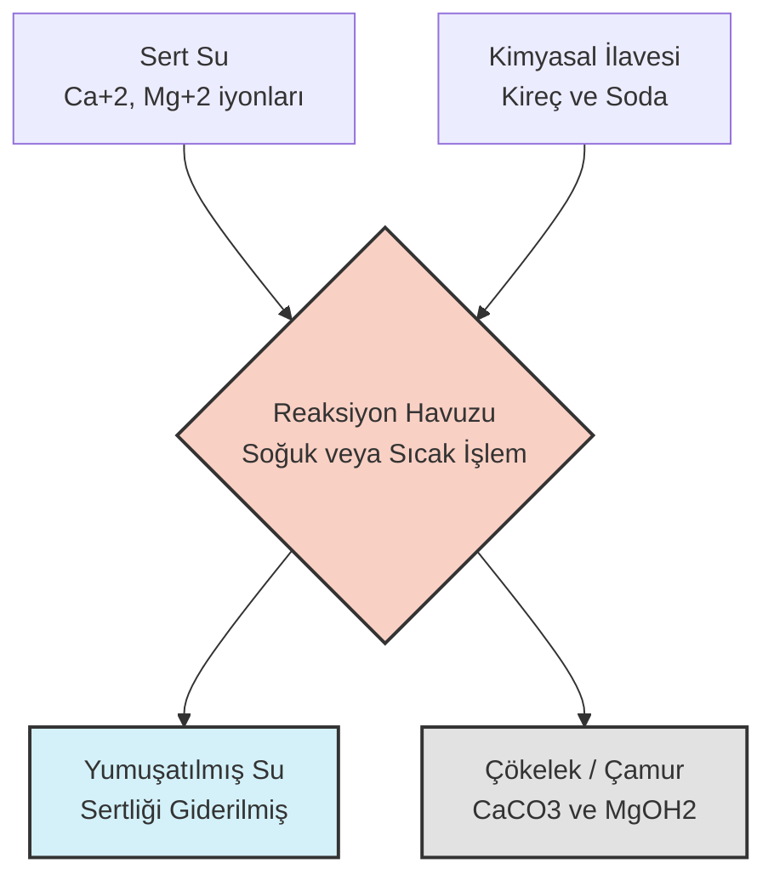

# Hafta 03: Su Saflaştırma Teknolojileri, Endüstriyel Gazlar ve Temel Kavramlar

## 1. Analitik Kimya ve Karışımlar (Dersten Notlar)
* **Gravimetrik Faktör:** Analitik kimyada, tartılan bir maddenin kütlesinden aranan maddenin kütlesine matematiksel geçiş yapmak için kullanılan orandır.
* **Azeotrop Karışım:** Kaynatıldığında buharının bileşimi sıvının bileşimiyle aynı olan, bu nedenle basit ayrımsal damıtma ile daha fazla saflaştırılamayan karışımlardır. 
* **Etil Alkol ve Su:** Etil alkol %96 oranında su ile azeotrop oluşturur. Normal damıtma ile %100 saf alkol elde edilemez.
* **Moleküler Elek (Zeolit):** %96'lık etil alkolü fiziksel olarak %100 (mutlak) etil alkole çevirmek için suyu hapseden zeolitler (moleküler elekler) kullanılır.
* **Leidenfrost Etkisi:** Sıvı azot gibi dondurucu (kriyojenik) bir sıvının, kaynama noktasından çok daha sıcak bir yüzeye temas ettiğinde, yüzeyle sıvı arasında yalıtkan bir buhar tabakası oluşması ve sıvının yüzeyde damlacık halinde asılı kalması olayıdır[cite: 30].

## 2. Su Kalitesi ve Sertlik Kavramı
* **İçme Suyu Kriteri:** Doğal suların pH değeri 4-9 arasında değişmektedir[cite: 17]. İçme suları hastalık yapıcı patojen organizmalar barındırmamalıdır, bu sebeple **%0 koliform** (bağırsak kökenli bakteri) içermesi kesin bir şarttır[cite: 17].
* **Sertlik Tanımı:** Suyun sabunu çöktürme özelliğine sertlik denir[cite: 18].
* **Geçici ve Kalıcı Sertlik:**
  * *Geçici Sertlik:* Kalsiyum ve magnezyum bikarbonatlarının sebep olduğu, kaynatılarak giderilebilen sertliktir[cite: 18].
  * *Kalıcı Sertlik:* Kalsiyum ve magnezyum klorür, sülfat, fosfat veya silikat tuzlarının oluşturduğu sertliktir[cite: 18]. İkisinin toplamı "Toplam Sertlik"tir[cite: 18].
* **Sertlik Birimleri:**
  * **Fransız Sertliği (FS):** Litrede 10 mg Kalsiyum Karbonat ($CaCO_3$) kapsayan suyun sertliğidir[cite: 20].
  * **İngiliz Sertliği (İS):** 1 galon (0.7 L) suda 10 mg $CaCO_3$ kapsayan suyun sertliğidir[cite: 20].
  * **Alman Sertliği (AS):** Litrede 10 mg Kalsiyum Oksit ($CaO$) kapsayan suyun sertliğidir[cite: 20]. Kalsiyum oksit ($CaO$), su sertliği ifade edilirken anlamlı bir referans birim olarak kabul edilir. (1 AS = 1.25 İS = 1.79 FS)[cite: 15].
* **Kalsiyum Tayini ve Sitokiyometri:** Suda kalsiyum miktarını saptarken doğrudan kalsiyumu değil, **kalsiyum karbonatı ($CaCO_3$)** referans alırız. Kalsiyum ($Ca^{+2}$) ve magnezyum ($Mg^{+2}$) iyonlarının sitokiyometrilerinin aynı olması durumunda hesaplamalar bu ortak referans üzerinden kolaylaştırılır.

## 3. Su Arıtma, Saflaştırma ve Yumuşatma İşlemleri
Sulara uygulanan arıtma yöntemleri 3'e ayrılır:
1. **Fiziksel İşlemler:** Izgaradan geçirme, süzme, çöktürme, gaz transferi[cite: 19].
2. **Kimyasal İşlemler:** Koagülasyon, çöktürme ve iyon değişimi[cite: 19].
3. **Biyolojik İşlemler:** Biyolojik süzme ve aktif çamur işlemleri[cite: 19].

* **Soğuk Kireç-Soda İşlemi (⚠ Kesin Sınav Sorusu):** Kısmi yumuşatma için, özellikle şehir sularında uygulanır[cite: 21]. Proses sırasında su önce kireç ($CaO$ veya $Ca(OH)_2$), sonra soda ($Na_2CO_3$) ile muamele edilir[cite: 21]. Sertlik, $CaCO_3$ ve magnezyum hidroksit halinde çöktürülerek uzaklaştırılır[cite: 21].
* **Sıcak Kireç-Soda İşlemi (⚠ Kesin Sınav Sorusu):** Buhar kazanı besleme suyunun yumuşatılmasında kullanılır[cite: 22]. Kaynama sıcaklığına yakın çalışıldığı için tepkime daha hızlıdır, pıhtılaşma/çökelme kolaylaşır, CO2 ve hava gibi çözünmüş gazlar uzaklaştırılır[cite: 22].
* **İyon Değişimi:** Sıvı fazdaki iyonların katı fazdaki iyonlarla yer değiştirmesidir. Fonksiyonel gruplara sahip katyon veya anyon değiştirici reçineler kullanılır[cite: 13].

### Kireç-Soda Prosesi Akım Şeması

## 4. Endüstriyel Gazlar ve Azot ($N_2$)
* **Reaktiflik ve Asitlik:** Elementel haldeki tekil atomlar reaktif değildir. Karbondioksit ($CO_2$) suda çözündüğünde asit oluşturduğu için **asidik** bir gazdır.
* **Azotlu Bileşiklerin Sınırları:** Azotlu bileşikler kimyasal zincirlerde sülfürik asite kadar gidebilen reaksiyonlara dâhil olabilir.
* **Yoğunluk Karşılaştırması:** Azot ($N_2$), oksijenden ($O_2$) daha **hafiftir**[cite: 27]. Kükürtdioksit ($SO_2$) ise havadan oldukça **ağırdır** ve zemine çöker.
* **Azotun Özellikleri:** Atmosferde %78 oranında bulunur[cite: 24, 27]. Renksiz, kokusuz, nötral ve inert (kimyasal tepkimeye girmeyen) bir gazdır[cite: 27]. 
* **Önemli Bileşikler ve Formülleri:**
  * **Amonyak:** $NH_3$ (Üretiminde azot gazı kullanılır[cite: 27]).
  * **Üre:** $CO(NH_2)_2$
  * **Nitrik Asit:** $HNO_3$
* **Kullanım Alanları:** Gıda, cam, çelik ve elektrik endüstrilerinde koruyucu atmosfer olarak; gübre, patlayıcı (nitrogliserin), boyar madde, parfüm, plastik ve ziraî ilaç üretiminde ise hammadde olarak kullanılır[cite: 26, 27].
* **Laboratuvar Üretimi:** Sodyum azid ($NaN_3$) ve amonyum dikromat bozunması veya amonyağın kireç kaymağı ile reaksiyonu ($2NH_3 + 3Ca(OCl)_2 \rightarrow 3CaCl_2 + N_2 + 3H_2O$) ile saf olarak elde edilir[cite: 28].
* **Endüstriyel Üretim (Sıvılaştırma):** Havanın sıvılaştırılıp fraksiyonlu damıtılması ile elde edilir[cite: 29]. Hava filtre edilip 77 psi basınçta sıkıştırılır[cite: 29]. Oksidasyon bölmesinde su ve $CO_2$ safsızlıkları ayrılır[cite: 29]. Sıvı azot -196 °C, oksijen -183 °C'de kaynadığı için kolonlarda bu kaynama noktası farkından yararlanılarak ayrıştırılır[cite: 29].

## 5. Sıvı Azot
* Çok düşük sıcaklıkta sıvı halde bulunan soğutucu (kriyojenik) bir maddedir[cite: 30]. Atmosfer basıncında 77 K (-196 °C) sıcaklıkta donar/kaynar[cite: 30].
* Canlı dokuyla temas ettiği anda donmaya neden olur[cite: 30]. Canlı hücrelerin (sperm, yumurta) dondurularak korunmasında, bilimsel çalışmalarda, gıda muhafazası ve dermatolojide (kanser riski taşıyan cilt yaralarının soğutularak alınmasında) kullanılır[cite: 30].
