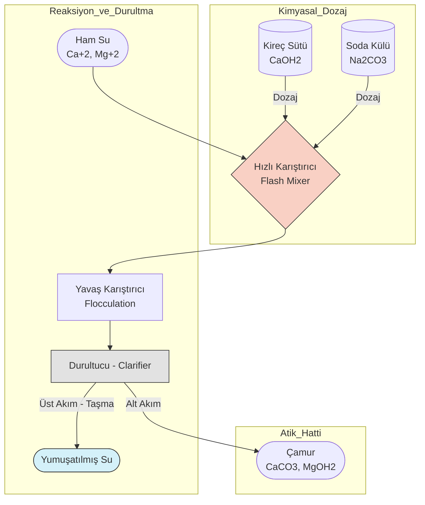
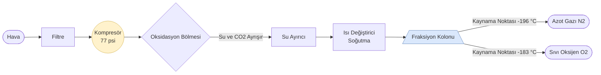

# Hafta 03: Su Saflaştırma Teknolojileri, Endüstriyel Gazlar ve Temel Kavramlar

## 1. Analitik Kimya, Karışımlar ve Termodinamik Temeller
* **Gravimetrik Faktör (GF):** Analitik kimyada, tartımı yapılan bir çökeleğin kütlesinden, numune içindeki asıl aranan maddenin kütlesine stokiyometrik olarak geçiş yapmayı sağlayan çarpım faktörüdür. 
* **Azeotropik Karışımlar:** Kaynatıldığında buharının bileşimi sıvının bileşimiyle aynı olan, bu nedenle basit ayrımsal damıtma (distilasyon) ile daha fazla saflaştırılamayan karışımlardır. 
* **Etil Alkol ve Zeolit (Moleküler Elek):** Etil alkol, %96 oranında su ile azeotrop oluşturur ve damıtma ile %100 saf alkol elde edilemez. Kalan %4'lük suyu ortamdan ayırmak için gözenek yapıları suyu fiziksel olarak hapseden zeolitler (moleküler elekler) kullanılır.
* **Gazların Yoğunluk ve Reaktifliği:** 
  * Elemental haldeki tekil atomlar reaktif değildir. 
  * Karbondioksit ($CO_2$) suda çözündüğünde asit oluşturduğu için **asidik** bir gazdır.
  * Azot ($N_2$), oksijenden ($O_2$) daha hafiftir[cite: 27]. Kükürtdioksit ($SO_2$) ise havadan ağırdır ve zemine çökelme eğilimindedir.

## 2. Su Kalitesi ve Özellikleri
Standartların dışındaki sulara kullanım alanlarına göre arıtım, yumuşatma veya saflaştırma işlemi uygulanır[cite: 12]. 
* **Bakteriyolojik ve Kimyasal Kriterler:** Doğal suların pH değeri 4-9 arasında değişmektedir[cite: 17]. Suda kalsiyum, magnezyum, sülfat, klorür gibi maddeler bulunabilir[cite: 17]. İçme suları hastalık yapıcı organizmalar barındırmamalıdır, bu sebeple **%0 koliform** (sıfır koliform) içermesi kesin bir şarttır[cite: 17].
* **Su Sertliği Sınıflandırması:** Suyun sabunu çöktürme özelliğine sertlik denir[cite: 18].
  * **Geçici Sertlik:** Kalsiyum ve magnezyum bikarbonatlarının sebep olduğu, kaynatılarak giderilebilen sertliktir[cite: 18].
  * **Kalıcı Sertlik:** Kalsiyum ve magnezyum klorür, sülfat, fosfat tuzlarının oluşturduğu, kaynamayla giderilemeyen sertliktir[cite: 18].
* **Kalsiyum Tayini ve Sitokiyometri:** Suda kalsiyum miktarı saptanırken $Ca^{+2}$ ve $Mg^{+2}$ iyonlarının sitokiyometrileri aynı olduğu için, hesaplamalar ortak bir referans olan **kalsiyum karbonat ($CaCO_3$)** üzerinden yapılır.
* **Sertlik Birimleri:**
  * **Fransız Sertliği (FS):** Litrede 10 mg $CaCO_3$ kapsayan suyun sertliğidir[cite: 20]. *(0-7.5 Çok Yumuşak, 7.5-15 Yumuşak, 15-30 Sert, 30-55 Çok Sert)*[cite: 15].
  * **İngiliz Sertliği (İS):** 1 galonda (0.7 L) 10 mg $CaCO_3$ kapsayan suyun sertliğidir[cite: 20].
  * **Alman Sertliği (AS):** Litrede 10 mg Kalsiyum Oksit ($CaO$) kapsayan suyun sertliğidir[cite: 20]. *(1 Alman Sertliği = 1.25 İngiliz Sertliği = 1.79 Fransız Sertliği)*[cite: 15].

## 3. Su Arıtma, Saflaştırma ve Yumuşatma İşlemleri
* **Fiziksel İşlemler:** Izgaradan geçirme, süzme, çöktürme, gaz transferi[cite: 19].
* **Kimyasal İşlemler:** Koagülasyon, kimyasal çöktürme ve iyon değişimi[cite: 19].
* **Biyolojik İşlemler:** Biyolojik süzme ve aktif çamur[cite: 19].
* **İyon Değişimi:** Sıvı fazdaki iyonların katı fazdaki iyonlarla yer değiştirmesidir[cite: 13]. Negatif fonksiyonel gruplar katyon değiştirici, pozitif fonksiyonel gruplar anyon değiştirici reçineler oluşturur[cite: 13].
* **Tuz Giderme:** Tuzlu suyla dolu kapalı odalara yerleştirilmiş seri katyon ve anyon değiştiricilerden elektrik akımı geçirilmesiyle yapılır[cite: 22].
* **Demineralizasyon:** Yüksek basınçlı buhar kazanlarındaki suyu ve endüstriyel durulama sularını yumuşatmada kullanılır[cite: 21].

## 4. Kireç-Soda Prosesleri (⚠️ Kritik Sınav Konusu)
* **Soğuk Kireç-Soda İşlemi:** Kısmi yumuşatma için, özellikle şehir sularında uygulanır[cite: 21]. Su önce kireç ($CaO$ veya $Ca(OH)_2$), sonra soda ($Na_2CO_3$) ile muamele edilerek sertlik yapan iyonlar $CaCO_3$ ve magnezyum hidroksit halinde çöktürülür[cite: 21].
* **Sıcak Kireç-Soda İşlemi:** Buhar kazanı besleme sularının yumuşatılmasında kullanılır[cite: 22]. Kaynama sıcaklığına yakın çalışıldığı için tepkime daha hızlıdır, çökelme kolaylaşır ve $CO_2$, hava gibi çözünmüş gazlar uzaklaştırılır[cite: 22].

### Proses Akım Şeması (PFD): Sıcak/Soğuk Kireç-Soda Ünitesi

## 5. Azotun Endüstrideki Yeri ve Azot Döngüsü
Azot doğada en çok bulunan elementlerden biridir ve atmosferde %78 oranında bulunur[cite: 24, 27].
* **Azot Döngüsü:** Volkanik faaliyetler, yıldırım ve şimşek ile serbest azot oksijenle birleşerek nitrit ve nitrata dönüşür[cite: 24]. Topraktaki kök bakterileri bu nitratları alarak bitkilerin yapısına katar[cite: 24].
* **Kullanım Alanları:** Azotlu gübre üretimi, patlayıcılar (nitrogliserin), boyar maddeler, ilaç sanayi (morfin, quinin, asetanilit), parfüm, plastik üretimi, herbisitler ve metal endüstrisi[cite: 26]. Azotlu bileşikler sülfürik asite kadar giden tepkimelere girebilir.

## 6. Azot Gazı ($N_2$) Özellikleri ve Üretimi
Renksiz, kokusuz, nötral ve inerttir (kimyasal tepkimeye girmez)[cite: 27]. Amonyak ($NH_3$) ve nitritlerin üretiminde ana girdidir[cite: 27]. Cam üretiminde pürüzsüz yüzey eldesi, çelik endüstrisinde oksidasyonun engellenmesi, gıdalarda bozulmanın önlenmesi için inert atmosfer oluşturur[cite: 27].

* **Laboratuvar Üretimi:** 
  * Sodyum azid bozunması: $2NaN_3 \rightarrow 2Na + 3N_2$[cite: 28]
  * Amonyağın kireç kaymağı ile reaksiyonu: $2NH_3 + 3Ca(OCl)_2 \rightarrow 3CaCl_2 + N_2 + 3H_2O$[cite: 28]
  * Amonyum dikromat bozunması: $(NH_4)_2Cr_2O_7 \rightarrow N_2 + Cr_2O_3 + 4H_2O$[cite: 28]

### Endüstriyel Azot Üretimi (Fraksiyonlu Damıtma PFD)
Endüstride yüksek saflıkta azot gazı havanın sıvılaştırılarak damıtılmasıyla elde edilir[cite: 29].

## 7. Sıvı Azot ve Leidenfrost Etkisi
* Çok düşük sıcaklıkta sıvı halde bulunan soğutucu (kriyojenik) bir maddedir[cite: 30]. Atmosfer basıncında 77 K (-196 °C) sıcaklıkta kaynar, 63 K (-210 °C) sıcaklıkta donar[cite: 30]. Canlı bir dokuyla temas ettiği anda anında donmaya neden olur[cite: 30].
* **Leidenfrost Etkisi:** Sıvı azot gibi kriyojenik sıvıların, kaynama noktasından çok daha yüksek sıcaklıktaki bir yüzeye temas ettiğinde anında buharlaşarak yüzey ile sıvı damlası arasında yalıtkan bir buhar katmanı oluşturması olayıdır[cite: 30].
* **Kullanımı:** Canlı hücrelerin (sperm, yumurta) dondurulması, gıda muhafazası, dermatolojide siğil veya kanser riski taşıyan dokuların dondurularak alınması işlemlerinde kullanılır[cite: 30].
