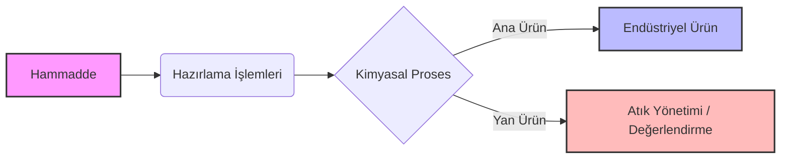

# KMB439 - Kimyasal Teknolojiler

Bu klasör, **KMB439 Kimyasal Teknolojiler** dersi notlarını, özetlerini ve proses akım şemalarını (flowchart) içermektedir[cite: 1].

## 📖 Ders İçeriği ve Hafta Takibi

- [ ] **Hafta 01:** Giriş: Dersin tanıtımı, amaç, kapsam ve kimyasal teknolojilere genel bakış[cite: 2]
- [ ] **Hafta 02:** Endüstriyel hammaddeler, hazırlama işlemleri, enerji tüketimi ve endüstriyel atık yönetimi[cite: 2]
- [ x ] **Hafta 03:** Endüstriyel gazlar: üretim yöntemleri ve kullanım alanları[cite: 2]
- [ ] **Hafta 04:** Su teknolojisi: arıtma yöntemleri, endüstriyel kullanım ve geri dönüşüm[cite: 2]
- [ ] **Hafta 05:** Seramik endüstrileri: hammaddeler, üretim yöntemleri ve uygulama alanları[cite: 2]
- [ ] **Hafta 06:** Çimento endüstrisi: üretim prosesleri ve çevresel etkiler[cite: 2]
- [ ] **Hafta 07:** Cam endüstrisi: üretim teknikleri ve kullanım alanları[cite: 2]
- [ ] **Hafta 08:** Ara sınav[cite: 2]
- [ ] **Hafta 09:** Asitler ve bazlar: Sülfürik asit, nitrik asit, fosforik asit, hidroklorik asit üretim teknolojileri[cite: 2]
- [ ] **Hafta 10:** Klor, sodyum hidroksit, soda, mineral gübreler[cite: 2]
- [ ] **Hafta 11:** Demir-çelik ve alüminyum endüstrisi[cite: 2]
- [ ] **Hafta 12:** Kâğıt endüstrisi ve odunun kimyasal olarak işlenmesi[cite: 2]
- [ ] **Hafta 13:** Yağlar, sabun, deterjan ve plastik teknolojisi[cite: 2]
- [ ] **Hafta 14:** Petrol teknolojisi ve sürdürülebilir kalkınma perspektifi[cite: 2]
- [ ] **Hafta 15:** Genel değerlendirme, endüstriyel ziyaret / seminer çalışmaları[cite: 2]

## 🔄 Örnek Proses Akım Şeması

Aşağıda, Markdown dosyalarında Mermaid kodları kullanılarak oluşturulmuş basit bir kimyasal proses akım şeması (hammaddeden ürüne değişim[cite: 3]) örneği bulunmaktadır. İlerleyen haftalarda gerçek prosesleri bu şekilde modelleyeceğiz:

