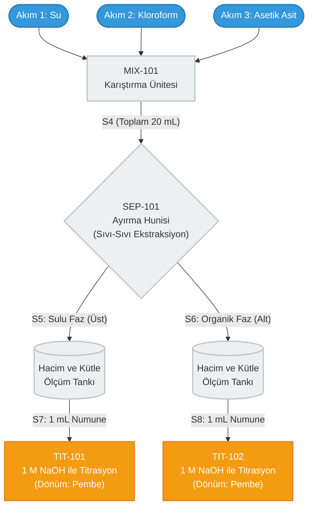

# KMB405 - Kimya Mühendisliği Lab III: Deney 1
## Üç Bileşenli Sistemlerde Faz Dengesi (Asetik Asit - Kloroform - Su)

**Tarih:** 12 Ekim 2026 | **Saat:** 10:15 | **Grup:** B5[cite: 7, 12] 
**Laboratuvar:** MAYMER Laboratuvarı | **Sorumlu:** Arş. Gör. Esma Yeliz KAYA[cite: 6, 11]

---

### 1. Teorik Altyapı ve Fiziksel Konsept
Termodinamik olarak birbiriyle karışmayan veya kısmen karışan iki çözücü (bu sistemde su ve kloroform) bir araya getirildiğinde kimyasal yapıları gereği iki ayrı sıvı faz oluştururlar[cite: 14, 16]. Bu ikili karışıma, her iki çözücüde de çözünebilme afinitesine sahip üçüncü bir bileşen (asetik asit) eklendiğinde, bu bileşen sistemin kimyasal potansiyeli her iki fazda eşitlenene dek su ve kloroform fazları arasında dağılır[cite: 14, 16]. 

### 2. Termodinamik Serbestlik ve Gibbs Faz Kuralı
Kimyasal reaksiyonun söz konusu olmadığı sistemlerde faz ilişkisi Gibbs Faz Kuralı ile ifade edilir[cite: 14]:
$$F = C - P + 2$$
Burada $F$ serbestlik derecesini, $C$ bileşen sayısını, $P$ sistemde bulunan faz sayısını, $2$ ise sıcaklık ve basınç sabitini göstermektedir[cite: 14].

**Sisteme Özel İndirgeme:**
Üç bileşenli faz diyagramları genellikle sabit basınç ve sıcaklıkta (izotermal ve izobarik) çalışılır[cite: 14]. Dış etkilerin sabit tutulduğu bu sistemlerde formül $F = C - P$ şekline indirgenir[cite: 14].
*   Bileşen sayısı ($C$) = 3 (Su, Kloroform, Asetik asit)[cite: 16]. 
*   Faz sayısı ($P$) = 2 (Organik alt faz ve sulu üst faz).
*   **F = 3 - 2 = 1**
Serbestlik derecesinin 1 olması, bu termodinamik denge durumunu tam tanımlayabilmek için yalnızca tek bir bağımsız değişkene (örneğin fazlardan birindeki asetik asit derişimine) ihtiyaç duyulduğunu kanıtlar.

### 3. Kompozisyon Analizi ve Roozeboom Diyagramları (Örnekli Anlatım)
Sabit basınç ve sıcaklıkta üç bileşenli sistemlerin faz diyagramlarını iki boyutlu uzayda çizmek için eşkenar üçgen (Roozeboom diyagramları) kullanılır[cite: 14].

Aşağıdaki şemada, 3 bileşenli bir karışımı temsil eden **M₁** noktasının okuma algoritması gösterilmiştir:

```text
                           Aseton (B)
                             %100
                              /\
                             /  \
                            /    \
                           /      \
          (LMP Doğrusu)   /        \
       %40 Aseton <-------.......... M₁ 
                        /         .  \
                       /         .    \  (KMN Doğrusu)
                      /         .      \
                     /         .        \
                    /         .          \
                   /         .            \
           Su (A) -------------------------- Kloroform (C)
            %100             |               %100
                           %20 Su        
                        (RMO Doğrusu)  
```

**Diyagramın Anatomisi ve Okuma Kuralları:**
*   **Köşeler (A, B, C):** Saf (%100) bileşenleri temsil eder[cite: 14, 15]. A köşesi %100 Su, B köşesi %100 Aseton, C köşesi %100 Kloroformdur[cite: 14, 15].
*   **Kenarlar (AB, BC, CA):** İki bileşenli (ikili) sistemleri temsil eder[cite: 14, 15].
*   **İç Bölge ($M_1$ Noktası):** Üç bileşenin de bulunduğu (ternary) karışımları temsil eder[cite: 15]. 

**M₁ Noktasının Kompozisyonunu Okuma Algoritması:**
Diyagramın tam içindeki $M_1$ noktasından üçgenin kenarlarına **paralel doğrular** çizeriz ve eksenleri kestiği yeri okuruz[cite: 15, 16]:

1.  **Aseton (B) Yüzdesini Okumak:** $M_1$ noktasından AC (Su-Kloroform) tabanına paralel çizilen LMP doğrusunu takip edin. B eksenine (sola) gittiğimizde okunan değer **%40 Aseton**'dur[cite: 15, 16].
2.  **Su (A) Yüzdesini Okumak:** $M_1$ noktasından BC (Aseton-Kloroform) sağ kenarına paralel çizilen RMO doğrusunu (aşağıya) takip edin. A tabanında okunan değer **%20 Su**'dur[cite: 15, 16].
3.  **Kloroform (C) Yüzdesini Okumak:** Kalan yüzde doğrudan kloroforma aittir veya AB kenarına paralel çizilerek C ekseninden okunur (**%40 Kloroform**)[cite: 15, 16].

> **Mühendislik Sağlaması:** Okuduğunuz tüm bileşen yüzdelerinin toplamı daima %100 olmalıdır ($40 + 20 + 40 = 100$)[cite: 15].

### 4. Proses Akım Şeması (PFD - Endüstriyel Standart)
Asetik asit-kloroform-su karışımları toplam 20 ml olarak hazırlanıp ayırma hunisinde faz dengesine ulaşması sağlanır[cite: 16]. Ardından 1 M NaOH ve fenolftalein kullanılarak titrasyon gerçekleştirilir[cite: 16].



### 5. Deneysel Veriler ve Hesaplamalar Tablosu
Laboratuvar ortamında elde edilecek değerler aşağıdaki tablolara işlenmelidir[cite: 16, 17].

*   $T=..........................^{\circ}C$[cite: 16]
*   $P=..................atm$[cite: 16]

**Tablo 1: Denge doğruları üzerinde seçilen noktalardaki kompozisyonların oluşturulması**[cite: 17]

| Bileşen | Asetik Asit | Kloroform | Su |
| :--- | :--- | :--- | :--- |
| **Yoğunluk** | | | |
| **Numune** | **Kütle (%) / Hacim (ml)** | **Kütle (%) / Hacim (ml)** | **Kütle (%) / Hacim (ml)** |
| **M1** | | | |
| **M2** | | | |
| **M3** | | | |

*Not: Titrasyonda kullanılan asetik asit-su-kloroform karışımı 1 ml; Titrasyon için kullanılan baz ve konsantrasyonu NaOH, 1 M'dır*[cite: 17].

**Tablo 2: Denge doğrusu üzerinde seçilen noktalardaki alt ve üst bileşimlerin belirlenmesi**[cite: 17]

| Nokta Adı | Üst Faz Hacim (ml) | Üst Faz Kütle (g) | Harcanan Baz (ml) | Alt Faz Hacim (ml) | Alt Faz Kütle (g) | Harcanan Baz (ml) |
| :---: | :---: | :---: | :---: | :---: | :---: | :---: |
| **M1** | | | | | | |
| **M2** | | | | | | |
| **M3** | | | | | | |

### 6. Kritik İş Sağlığı, Güvenliği ve Çevre (HSE) Standartları
*   **Kloroform ($CHCl_3$):** Toksik ve kanserojen etkileri bilinen bir solventtir[cite: 16]. Buharlarının solunmaması için deney mutlak suretle **çeker ocakta** çalışılmalıdır[cite: 16].
*   **Asetik Asit ($CH_3COOH$):** Cilt, göz ve solunum yollarına zarar verebilen aşındırıcı ve yanıcı bir organik asittir[cite: 16].
*   **Genel KKD:** Deney sırasında eldiven, laboratuvar önlüğü ve koruyucu gözlük kullanılması zorunludur[cite: 5, 10, 16]. Temas halinde bölge bol suyla yıkanmalı ve MSDS formlarındaki riskler dikkate alınmalıdır[cite: 16, 17].
   ###  7. Kapsamlı Sınav Senaryosu: Deney Düzeneği ve Grafik Entegrasyonu

**Deneysel Senaryo:** 
Laboratuvarda asetik asit-kloroform-su sistemini inceliyorsunuz. Şekil 1'deki Roozeboom diyagramı üzerinde gösterilen bir $M_2$ başlangıç karışımı hazırlanmış ve 20 mL'lik ayırma hunisine alınmıştır. Termodinamik dengeye ulaşıldıktan sonra faz ayrımı gerçekleşmiş; üst faz (sulu) ve alt faz (organik) ayrıştırılarak 1'er mL numuneler alınmış ve 1 M NaOH ile titre edilmiştir. 

### 8. Termodinamik Analiz İçin Titrasyon Temelleri ve Laboratuvar Prosedürü

**1 Molar (1 M) Ne Demektir?**
Molarite ($M$), kimyada derişimi (konsantrasyonu) ifade eden en temel mühendislik birimidir ve 1 litre çözeltide çözünmüş maddenin "mol" sayısını belirtir ($M = n/V$). 
Deneyde kullandığımız **1 M NaOH** (Sodyum Hidroksit), 1 litre çözeltide tam 1 mol (yani 40 gram) saf NaOH çözünmüş demektir[cite: 17]. Bu, konsantrasyonu kesin olarak "bilinen" standart çözeltimizdir (Titrant). Amacımız bu bilinen derişimi kullanarak, numunemizdeki "bilinmeyen" asetik asit miktarını tespit etmektir.

**Titrasyonun Kimyasal Mantığı:**
Ortamdaki asetik asit ($CH_3COOH$), büretten eklediğimiz baz ($NaOH$) ile birebir oranda nötrleşme reaksiyonuna girer:
$$CH_3COOH + NaOH \rightarrow CH_3COONa + H_2O$$
Bu stokiyometrik denkleme göre 1 mol asetik asidi yok etmek (nötrlemek) için tam 1 mol NaOH gerekir. Eğer reaksiyonu bitirmek için ne kadar NaOH harcadığımızı bulursak, kütle denkliği prensibiyle numune içinde ne kadar asetik asit bulunduğunu kanıtlamış oluruz.

**Adım Adım Laboratuvar Prosedürü (Hangisinden Ne Kadar Katıyoruz?)**

1. **Numune Alımı (Analit):** Ayırma hunisinde termodinamik dengeye gelip ayrışan fazlardan birinden (örneğin üstteki sulu fazdan) pipet yardımıyla hassas bir şekilde **tam 1 mL** numune çekilip boş bir erlenmayere (koni şeklindeki cam kaba) aktarılır[cite: 17].
2. **İndikatör İlavesi:** Erlenmayerin içindeki 1 mL'lik numunenin üzerine birkaç damla **Fenolftalein** indikatörü damlatılır[cite: 16]. Fenolftalein asidik ortamda renksizdir; ortam nötrlenip hafifçe baza kaydığı an rengi pembeye döner[cite: 16].
3. **Büretin Hazırlanması (Titrant):** Üzerinde hacim çizgileri (mL) bulunan uzun ve musluklu cam boruya (bürete) **1 M NaOH** çözeltisi doldurulur ve sıvı seviyesinin başlangıç noktası not edilir[cite: 16, 17].
4. **Titrasyon İşlemi:** Büretin musluğu hafifçe açılarak erlenmayere damla damla NaOH eklenir. Lokal asit-baz birikmelerini önlemek için erlenmayer sürekli olarak dairesel hareketlerle çalkalanır.
5. **Dönüm Noktası (Eşdeğerlik Noktası):** Erlenmayerdeki sıvının rengi kalıcı, uçuk bir pembe renge dönüştüğü ilk an (tüm asetik asidin tükendiği ve ortamda ilk fazla NaOH damlasının kaldığı an) musluk derhal kapatılır.
6. **Veri Okuma:** Büretteki sıvı seviyesinin ne kadar düştüğüne bakılarak, işlem boyunca erlenmayere toplam kaç mL NaOH eklendiği okunur. Bu değer, hesaplama tablolarındaki "$V_{harcanan}$" değeridir.

**Örnek Bir Mühendislik Hesaplaması (Döngünün Tamamlanması):**
Diyelim ki o 1 mL'lik alt faz numunesini titre ederken büretten tam **3 mL (0.003 Litre)** NaOH harcadınız.
*   **Harcanan NaOH Molü:** $n = M \times V \Rightarrow 1$ mol/L $\times 0.003$ L = $0.003$ mol NaOH.
*   **Asetik Asit Molü:** Reaksiyon 1:1 olduğu için numunenizin (o 1 mL'nin) içinde de tam **0.003 mol asetik asit** vardır.
*   **Asetik Asit Kütlesi:** $m = n \times MA \Rightarrow 0.003$ mol $\times 60$ g/mol = $0.18$ gram.

Yani denge halindeki o fazın her 1 mL'sinde 0.18 gram asetik asit bulunduğunu ispatlamış oldunuz. Tüm sistem bu basit oran üzerine kuruludur.

---

