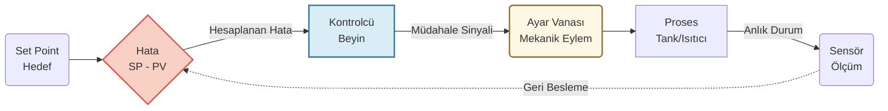

# BÖLÜM 0: SIFIRDAN PROSES KONTROL MANTIĞI VE 4 TEMEL ADIM

Diferansiyel denklemler, integraller ve karmaşık Laplace dönüşümleri ilk bakışta korkutucu görünebilir. Ancak proses kontrol, fiziksel dünyadaki bir mekanizmanın (örneğin bir 3D yazıcının sıcaklık kontrolü veya bir hidrolik valfin sıvı akışı) matematiksel bir dil ile ifade edilmesinden ibarettir. Sınavlarda karşımıza çıkan tüm o uzun denklemler, sistemin "dengesini" sağlamak için birbirini izleyen **4 sabit mantık adımına** dayanır.

---

## Proses Kontrol Aslında Nedir? (Büyük Resim)

Sistemi kontrol etmek demek, bir "Hedef" belirleyip, "Mevcut Durum" ile aradaki "Hatayı" sıfıra indirmeye çalışmak demektir.

*   **Set Point (İstenen Değer / SP):** Bizim mekanik veya termal hedefimiz (Örn: 60 °C sıcaklık).
*   **Process Variable (Ölçülen Değer / PV):** Sistemin o anki gerçek durumu (Örn: 50 °C).
*   **Hata (Error):** İstenen - Ölçülen. (Örn: Sistem 10 derece geride). 

---

## Adım Adım Sınav Reçetesi (Mantıksal İnşa)

### Adım 1: Korunum Prensibini Yaz (Fiziksel Mantık)
Her şey şu basit fizik kuralına dayanır: **Giren - Çıkan = Birikim**

> **Örnek Soru:** Sabit hacimli bir su tankına dakikada 10 litre su giriyor ve altındaki vanadan 10 litre su çıkıyor. Giriş vanasını açıp dakikada 12 litre su sokmaya başlarsak ne olur?
> 
> **Mantık:** 
> *   İlk Durum: $10 - 10 = 0$ (Birikim yok, sistem Kararlı Halde).
> *   İkinci Durum: $12 - 10 = 2$ (Dakikada 2 litre su içeride birikmeye ve seviye yükselmeye başlar).

Matematiksel olarak "Birikim", seviyenin zamanla değişmesidir ( $dh/dt$ ). Tankın kesit alanı $A$ ise, denklemimiz:

$$ A \frac{dh}{dt} = q_{giren} - q_{cikan} $$

### Adım 2: Sapma Değişkeni (Deviation) Oluştur
Mühendislikte tonlarca suyun mutlak hacmiyle uğraşmak yerine, sadece **"Sistem dengeden ne kadar şaştı?"** (Sapma) sorusuyla ilgileniriz. 

> **Mantık:**
> Giriş debisindeki şaşma (sapma) miktarı: $q_{giren}' = 12 - 10 = 2$ litre/dakika.
> Değişkenlerin üzerine kesme işareti ($'$) koyarak, sadece o artan "2 litrelik fazlalık" üzerinden yepyeni ve hafif bir denklem yazarız:

$$ A \frac{dh'}{dt} = q_{giren}' - q_{cikan}' $$

### Adım 3: Laplace Dönüşümü (Türevden Kurtulmak)
Çıkış debisini vana direncine ($R$) bağlı olarak yazarsak denklemimiz şu hali alır: $A \frac{dh'}{dt} = q_{giren}' - \frac{h'}{R}$. Bu denklemdeki o korkunç türevden ($\frac{dh'}{dt}$) kurtulmak için devreye Laplace girer.

> **Laplace Kuralı:** Zaman ($t$) dünyasındaki türevi alır, sanal ($s$) dünyasına basit bir çarpım ($s$) olarak atar. 
> Türev ($\frac{d}{dt}$) gördüğün yere $s$ yaz:

$$ A \cdot s \cdot H'(s) = Q_{giren}'(s) - \frac{H'(s)}{R} $$

Artık elimizde sadece harflerin çarpılıp bölündüğü, lise matematiğiyle çözülebilen cebirsel bir denklem var. $H'(s)$ yalnız bırakıldığında sınavların vazgeçilmezi olan **Transfer Fonksiyonu** elde edilir:

$$ \frac{H'(s)}{Q_{giren}'(s)} = \frac{1}{As + 1/R} $$

### Adım 4: Kısmi Kesirlere Ayırma ve Fiziksel Dünyaya Dönüş (Ters Laplace)
Diyelim ki işlemleri yaptık ve Laplace dünyasında şu sonuca ulaştık:

$$ H'(s) = \frac{2}{s(s+1)} $$

Bu birleşik kesri, Ters Laplace tablolarında bulabilmek için küçük parçalara (Kısmi Kesirlere) ayırmalıyız.

> **Pratik Kapatma Yöntemi:**

$$ \frac{2}{s(s+1)} = \frac{A}{s} + \frac{B}{s+1} $$

> *   **A'yı bulmak için:** $s$'yi sıfır yapan değer $0$'dır. Ana kesirde $s$'yi kapatıp geri kalanda $0$ yaz: $2 / (0+1) = 2 \implies A = 2$.
> *   **B'yi bulmak için:** $(s+1)$'i sıfır yapan değer $-1$'dir. Ana kesirde $(s+1)$'i kapatıp geri kalanda $-1$ yaz: $2 / (-1) = -2 \implies B = -2$.

Parçalanmış halimiz:

$$ H'(s) = \frac{2}{s} - \frac{2}{s+1} $$

**Tablo Kuralları:**
1. $Sayi / s$ daima sabit bir sayıya dönüşür $\implies 2$
2. $Sayi / (s+a)$ daima $e^{-at}$ fonksiyonuna dönüşür $\implies 2e^{-1t}$

**Zaman Domeni (Nihai Sonuç):**

$$ h'(t) = 2 - 2e^{-t} $$

**Fiziksel Yorum:** Kronometreye bastığında ($t=0$) hata sıfırdır. Saatler geçtiğinde ($t \to \infty$ iken $e^{-\infty} = 0$) hata $2 - 0 = 2$ birimde sabitlenir. Yani vanayı açtığımızda tankın seviyesi zamanla logaritmik olarak 2 metre yükselecek ve o noktada yeni bir dengeye oturacaktır.

### BÖLÜM 0.1: ADIM ADIM TEMEL KAVRAMA SORULARI (Antrenman Serisi)

Bu bölüm, proses kontrolün dört temel adımının matematiksel operasyonlar olmadan, tamamen fiziksel mantık üzerinden nasıl işlediğini gösteren "ısınma" sorularını içerir.

---

**Soru 1: Sadece 1. Adım (Fiziksel Mantık ve Kütle Denkliği)**
Sabit hacimli bir su tankına dakikada 10 litre su giriyor ve altındaki vanadan dakikada 10 litre su çıkıyor. Giriş vanasını biraz daha açıp dakikada 12 litre su sokmaya başlarsak, tankta bir dakikada ne kadarlık bir su birikimi olur?

**Çözüm 1:**
Proses Kontrolün temel anayasası şudur: Giren - Çıkan = Birikim
İlk Durum: 10 - 10 = 0 (Birikim yok, sistem Kararlı Halde).
İkinci Durum: 12 - 10 = 2 (Dakikada 2 litre su içeride birikmeye başlar).

Matematiksel olarak "Birikim", seviyenin zamanla değişmesidir ($dh/dt$). Tankın kesit alanı $A$ ise genel denklemimiz:

$$ A \frac{dh}{dt} = q_{giren} - q_{cikan} $$

---

**Soru 2: 1. ve 2. Adımlar Birlikte (Sapma - Hata Miktarını Bulmak)**
Yukarıdaki tank dengedeydi. Girişi 12 yaptık ve denge bozuldu. Tonlarca suyun hesabını yapmak yerine sadece "Sistem dengeden ne kadar şaştı?" (Sapma) sorusuyla ilgilenerek yeni denklemi nasıl yazarız?

**Çözüm 2:**
Giriş debisindeki sapma (hata) miktarı: $q'_{giren} = 12 - 10 = 2$ litre/dakikadır.
Tüm denklemi değişkenlerin üzerine kesme işareti ($'$) koyarak sadece şaşma miktarları üzerinden yazarız.

$$ A \frac{dh'}{dt} = q'_{giren} - q'_{cikan} $$

---

**Soru 3: 1, 2 ve 3. Adımlar Birlikte (Laplace ile Türevden Kurtulmak)**
Sapma denklemimizi çıkış vanasının direncini ($R$) katarak yazdık: $A(dh'/dt) = q'_{giren} - h'/R$
Bu denklemdeki türevden kurtulup, sistemi sınavlarda istenen "Transfer Fonksiyonu" haline nasıl getiririz?

**Çözüm 3:**
Laplace dönüşümü devreye girer. Türev ($d/dt$) gördüğümüz yere sanal $s$ çarpanını yazarız.

$$ A \cdot s \cdot H'(s) = Q'_{giren}(s) - \frac{H'(s)}{R} $$

Çıkış değişkeni olan $H'(s)$ yalnız bırakıldığında, sistemin dinamiğini gösteren transfer fonksiyonu elde edilir:

$$ \frac{H'(s)}{Q'_{giren}(s)} = \frac{1}{As + 1/R} $$

---

**Soru 4: Dört Adımın Tamamı (Ters Laplace ve Sonuca Ulaşmak)**
Sistem parametreleri (Alan, Direnç vb.) yerine konduğunda Laplace dünyasında $H'(s) = 2 / (s(s+1))$ sonucuna ulaştık diyelim. Bu sistemi saate bakarak görebileceğimiz gerçek zaman ($t$) dünyasına nasıl geri çeviririz?

**Çözüm 4:**
Tablolarda karşılığını bulabilmek için kesri basit parçalara (Kısmi Kesirlere) ayırırız.

$$ \frac{2}{s(s+1)} = \frac{A}{s} + \frac{B}{s+1} $$

Paydaları sıfır yapan kökleri yerine koyduğumuzda $A = 2$ ve $B = -2$ bulunur. Parçalanmış halimiz şudur:

$$ H'(s) = \frac{2}{s} - \frac{2}{s+1} $$

Ters Laplace tablo kuralları uygulanarak zaman domenine geçilir:

$$ h'(t) = 2 - 2e^{-t} $$

(Sistem başladığında sapma sıfırdır. Zaman sonsuza gittiğinde seviye sapması 2 metrede sabitlenir.)
