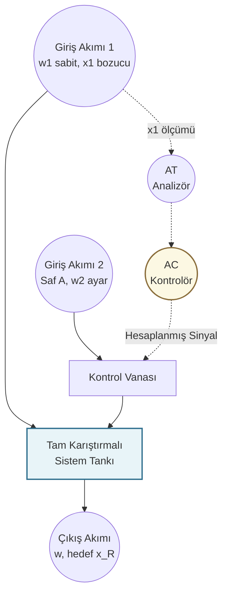

## KMB401 Proses Kontrol - Detaylı Çalışma ve Analiz Senaryoları

Bu bölüm, proses kontrol dinamiklerinin matematiksel temellerini ve fiziksel karşılıklarını birleştiren, sınav formatına uygun lisans seviyesi çalışma sorularını içermektedir. Çözümler, ezberden ziyade mühendislik yaklaşımını (modelleme, s-domenine geçiş, analiz) kavramaya yönelik olarak yapılandırılmıştır.

# KMB401 Proses Kontrol - Kapsamlı Sınav ve Vize Hazırlık Portfolyosu

## BÖLÜM 1: BİRİNCİ MERTEBEDEN SİSTEMLER VE BASAMAK ETKİSİ

### Soru 1: Birinci Mertebeden Sistemlerin Dinamik Analizi ve Son Değer Teoremi
**Soru:** Kimyasal bir prosesin dinamik davranışı, aşağıdaki denklem ile tanımlanmaktadır[cite: 21]:

$$ 2\frac{dy}{dt} + 8y = 4 $$

Sistemin başlangıç koşulu $y(0) = 2$ olarak verilmiştir[cite: 21]. Bu sistemi Laplace dönüşümü kullanarak zaman domeninde ($y(t)$) çözünüz ve sistemin ulaşacağı yeni kararlı hal değerini bulunuz[cite: 21].

**Mühendislik Çözüm Adımları:**

**Adım 1: Diferansiyel Denklemin s-Domenine Aktarılması**
Zaman domenindeki türevsel değişimleri çözebilmek için Laplace dönüşümü alınır. Başlangıç koşulu doğrudan işleme dahil edilir.

$$ 2[s Y(s) - y(0)] + 8 Y(s) = \frac{4}{s} $$

$$ 2[s Y(s) - 2] + 8 Y(s) = \frac{4}{s} $$

**Adım 2: Cebirsel Düzenleme ve Y(s)'in Yalnız Bırakılması**
Sistemin çıkış fonksiyonu $Y(s)$ bir tarafa toplanarak denklem çözülebilir kesir formuna getirilir.

$$ 2s Y(s) - 4 + 8 Y(s) = \frac{4}{s} $$

$$ Y(s)(2s + 8) = \frac{4s + 4}{s} $$

$$ Y(s) = \frac{2s + 2}{s(s + 4)} $$

**Adım 3: Kısmi Kesirlere Ayırma**
Ters Laplace tablosundaki standart formlara ulaşmak için kesir basit bileşenlere ayrılır.

$$ \frac{2s + 2}{s(s + 4)} = \frac{A}{s} + \frac{B}{s + 4} $$

Payları eşitleyerek ( $A(s + 4) + Bs = 2s + 2$ ) çözüm yapıldığında $A = 0.5$ ve $B = 1.5$ bulunur.

$$ Y(s) = \frac{0.5}{s} + \frac{1.5}{s + 4} $$

**Adım 4: Zaman Domenine Geri Dönüş ve Son Değer Analizi**
Ters Laplace alınarak zamana bağlı fonksiyon elde edilir:

$$ y(t) = 0.5 + 1.5 e^{-4t} $$

Sistem yeterince uzun süre çalıştırıldığında ( $t \to \infty$ ), geçici rejim biter ve yeni bir kararlı hale ulaşılır[cite: 21].

$$ y(\infty) = 0.5 + 0 = 0.5 $$


### Soru 2: Sıvı Seviye Kontrol Sistemi Analizi
**Soru:** Kesit alanı $A = 5$ metrekare olan bir prosese $q_i$ debisi ile sıvı beslenmektedir[cite: 21]. Çıkış debisi vananın direncine bağlı olarak $q_o = h / R$ kuralına göre değişmektedir ($R = 2$)[cite: 21]. Proses başlangıçta $2$ metreküp/dakika giriş debisi ile kararlı haldedir. Giriş debisinde aniden meydana gelen $0.5$ birimlik basamak artışı sonrasında sistemin seviye profili nasıl değişir[cite: 20, 21]?

**Mühendislik Çözüm Adımları:**

**Adım 1: Başlangıç Kararlı Hal Koşulları**
Bozucu etki gelmeden önce, giren sıvı miktarı çıkan sıvı miktarına eşittir. Tank başlangıçta 4 metre seviyesinde dengededir.

$$ q_{is} = q_{os} = \frac{h_s}{R} \implies 2 = \frac{h_s}{2} \implies h_s = 4 $$

**Adım 2: Fiziksel Kütle Denkliği ve Sapma Modeli**
Genel kütle korunum yasasına göre (Giriş - Çıkış = Birikim) denklem kurulur[cite: 20].

$$ A\frac{dh}{dt} = q_i - \frac{h}{R} $$

Sapma değişkenleri ( $h' = h - h_s$ ve $q_i' = q_i - q_{is}$ ) kullanılarak dinamik model yazılır:

$$ A\frac{dh'}{dt} = q_i' - \frac{h'}{R} $$

**Adım 3: Transfer Fonksiyonu ve Basamak Etki**
Başlangıç şartı sıfır kabul edilerek Laplace dönüşümü alınır ve sistem parametreleri ($A=5, R=2$) yerine konur[cite: 20]. 

$$ \frac{H'(s)}{Q_i'(s)} = \frac{R}{ARs + 1} = \frac{2}{10s + 1} $$

Basamak artışı $0.5$ olduğu için Laplace karşılığı $0.5 / s$ olur[cite: 20, 21].

$$ H'(s) = \left( \frac{2}{10s + 1} \right) \left( \frac{0.5}{s} \right) = \frac{0.1}{s(s + 0.1)} $$

**Adım 4: Kısmi Kesirler ve Gerçek Seviye**
Kısmi kesirlere ayrılıp ters Laplace alındığında sapma fonksiyonu bulunur:

$$ h'(t) = 1 - e^{-0.1t} $$

Gerçek tank seviyesi, başlangıçtaki seviye ile sapma miktarının toplamıdır:

$$ h(t) = h_s + h'(t) = 5 - e^{-0.1t} $$

---

## BÖLÜM 2: İLERİ DÜZEY VİZE SORULARI

### Soru 3: Üçüncü Mertebeden Laplace Analizi (35 Puan)
**Soru:** Kimyasal bir reaktörün davranışı aşağıdaki denklem ile ifade edilmektedir[cite: 26]:

$$ \frac{d^3x}{dt^3} - 7\frac{dx}{dt} - 6x = 5 $$

Başlangıç koşulları sıfırdır[cite: 26]. Sisteme uygulanan 5 birimlik basamak etki altındaki zaman yanıtını bulunuz[cite: 26, 27].

**Mühendislik Çözüm Adımları:**

**Adım 1: Laplace Dönüşümü ve Karakteristik Denklem**
Başlangıç koşulları sıfır olduğundan türev kuralları doğrudan uygulanır[cite: 26, 27].

$$ s^3 X(s) - 7s X(s) - 6 X(s) = \frac{5}{s} $$

$$ X(s)[s^3 - 7s - 6] = \frac{5}{s} $$

**Adım 2: Çarpanlara Ayırma ve Transfer Fonksiyonu**
Polinom bölmesi ile $s^3 - 7s - 6 = 0$ denkleminin kökleri $(s+1)$, $(s-3)$, ve $(s+2)$ olarak bulunur[cite: 26, 27].

$$ X(s) = \frac{5}{s(s+1)(s+2)(s-3)} $$

**Adım 3: Kısmi Kesirlere Ayırma İşlemi**

$$ \frac{5}{s(s+1)(s+2)(s-3)} = \frac{A}{s} + \frac{B}{s+1} + \frac{C}{s+2} + \frac{D}{s-3} $$

Kök yerine koyma yöntemi ile katsayılar bulunur[cite: 26]. Ters Laplace dönüşümü ile $x(t)$ elde edilir[cite: 26, 27].

---

### Soru 4: Başlangıç ve Son Değer Teoremleri (25 Puan)
**Soru:** Kompleks bir prosesin çıkış fonksiyonu aşağıda verilmiştir[cite: 28]:

$$ Y(s) = \frac{s^4 - 6s^2 + 9s - 8}{s(s-2)(s^3 + 2s^2 - s - 2)} $$

Limit teoremleri yardımıyla başlangıç ve son değerleri bulunuz[cite: 28].

**Mühendislik Çözüm Adımları:**

**Adım 1: Başlangıç Değer Teoremi**
Kural: limit ( $s \to \infty$ ) için $sY(s)$ hesaplanır[cite: 28]. Pay ve payda en yüksek dereceli terimlere bölünür.

$$ \lim_{s \to \infty} sY(s) = \frac{s^4 - 6s^2 + 9s - 8}{s^4 - 5s^2 + 4} = 1 $$

**Adım 2: Son Değer Teoremi**
Kural: limit ( $s \to 0$ ) için $sY(s)$ hesaplanır[cite: 28]. $s=0$ değeri fonksiyonda yerine yazılır.

$$ \lim_{s \to 0} \frac{s^4 - 6s^2 + 9s - 8}{(s-2)(s^3 + 2s^2 - s - 2)} = \frac{-8}{(-2)(-2)} = -2 $$

---

### Soru 5: Proses Modelleme ve Tasarım (40 Puan)
**Soru:** Akım 1 (kütlesel debisi $w_1$, derişimi $x_1$) ve Akım 2 (debisi $w_2$, derişimi $x_2 = 1$) karıştırılmaktadır[cite: 23]. 
a) İstenilen hedef bileşime ($x_R$) ulaşmak için $w_2$ debisinin formülü nedir[cite: 23]?
b) Sistemin yatışkın olmayan kütle denkliğini çıkarınız[cite: 25].

**Mühendislik Çözüm Adımları:**

**Adım 1: Kararlı Hal Kütle Denklikleri**
Toplam ve bileşen kütle denklikleri yazılır[cite: 23, 25]:

$$ w_1 x_{1s} + w_2(1) = (w_1 + w_2)x_R $$

Denklem $w_2$ için düzenlenir[cite: 23]:

$$ w_2 = w_1 \frac{x_R - x_{1s}}{1 - x_R} $$

**Adım 2: Yatışkın Olmayan Hal Modeli**
Bileşen kütle birikimi türevsel olarak ifade edilir[cite: 25]:

$$ \frac{d(V\rho x)}{dt} = w_1 x_1 + w_2 - wx $$

Türev açılımı ve kütle sadeleştirmesi yapıldığında nihai dinamik denklem elde edilir[cite: 25]:

$$ \rho V \frac{dx}{dt} = w_1(x_1 - x) + w_2(1 - x) $$
```
# KMB401 Proses Kontrol - Vize (Ara Sınav) Hazırlık Soruları

Bu bölüm, dersin eğitmeninin spesifik soru tiplerine (yüksek mertebeli Laplace dönüşümleri, limit teoremleri ve karışım prosesi modelleme) sadık kalınarak hazırlanmış ileri düzey lisans çalışma sorularını içermektedir.

---

### Soru 1: Üçüncü Mertebeden Sistem Dinamiği ve Laplace Analizi (35 Puan)
**Soru:** Kimyasal bir reaktörün dinamik davranışı, aşağıdaki 3. mertebeden lineer diferansiyel denklem ile ifade edilmektedir[cite: 26]:

$$ \frac{d^3x}{dt^3}-7\frac{dx}{dt}-6x=5 $$

Sistemin başlangıç koşulları $x(0)=0$, $x'(0)=0$ ve $x''(0)=0$ olarak verilmiştir[cite: 26]. 
Sisteme $t=0$ anında uygulanan $5$ birimlik basamak (step) etki altındaki zaman yanıtını ($x(t)$ fonksiyonunu) Laplace dönüşümü ve kısmi kesirlere ayırma yöntemini kullanarak elde ediniz[cite: 26, 27].

**Mühendislik Çözüm Şablonu:**
1.  **Her İki Tarafın Laplace Dönüşümünün Alınması:**
    Türev kuralları uygulanarak sistem $s$-domenine geçirilir[cite: 27].
    $[s^3X(s)-s^2x(0)-sx'(0)-x''(0)]-7[sX(s)-x(0)]-6X(s)=\frac{5}{s}$
2.  **Başlangıç Koşullarının Uygulanması:**
    Tüm başlangıç koşulları sıfır olduğundan denklem sadeleşir[cite: 26].
    $s^3X(s)-7sX(s)-6X(s)=\frac{5}{s}$
    $X(s)[s^3-7s-6]=\frac{5}{s}$
3.  **Karakteristik Denklemin Çarpanlarına Ayrılması:**
    Polinom bölmesi veya deneme yoluyla $s^3-7s-6=0$ denkleminin kökleri bulunur[cite: 26, 27]. $s=-1$ için denklem sıfırlanır, dolayısıyla $(s+1)$ bir çarpandır.
    $s^3-7s-6=(s+1)(s^2-s-6)=(s+1)(s-3)(s+2)$
    Buna göre transfer fonksiyonu:
    $X(s)=\frac{5}{s(s+1)(s+2)(s-3)}$
4.  **Kısmi Kesirlere Ayırma İşlemi:**
    $\frac{5}{s(s+1)(s+2)(s-3)}=\frac{A}{s}+\frac{B}{s+1}+\frac{C}{s+2}+\frac{D}{s-3}$
    Paylar eşitlenerek sabitler bulunur (Hocanın notlarındaki kök yerine koyma yöntemi ile çözülür)[cite: 26]. Örnek kök bulma adımı:
    *   $s=0$ için: $A(1)(2)(-3)=5 \implies -6A=5 \implies A=-5/6$
5.  **Ters Laplace ile Zaman Domenine Geçiş:**
    Bulunan katsayılarla ters Laplace standart formülü ($e^{at}$) kullanılarak sistemin açık dinamik yanıtı $x(t)$ elde edilir[cite: 26, 27].

---

### Soru 2: Başlangıç ve Son Değer Teoremleri (25 Puan)
**Soru:** Kompleks bir endüstriyel prosesin $s$-domenindeki çıkış fonksiyonu $Y(s)$ aşağıda verilmiştir[cite: 28]:

$$ Y(s)=\frac{s^4-6s^2+9s-8}{s(s-2)(s^3+2s^2-s-2)} $$

Bu sistemin zaman domenindeki karşılığını ($y(t)$) açıkça çözmeye gerek kalmadan, sistemin tam $t=0$ anındaki (başlangıç) ve sonsuz zamandaki ($t \to \infty$, yatışkın hal) değerlerini limit teoremleri yardımıyla bulunuz[cite: 28].

**Mühendislik Çözüm Şablonu:**
1.  **Başlangıç Değer Teoremi (Initial Value Theorem):**
    Kural: $\lim_{t\to0}y(t)=\lim_{s\to\infty}sY(s)$[cite: 28].
    $sY(s)=\frac{s(s^4-6s^2+9s-8)}{s(s-2)(s^3+2s^2-s-2)}=\frac{s^4-6s^2+9s-8}{s^4-5s^2+4}$
    Limit $s \to \infty$ için pay ve payda en yüksek dereceli $s^4$ parantezine alınır[cite: 28].
    $\lim_{s\to\infty}sY(s)=\frac{1-0+0-0}{1-0+0}=1$ (Başlangıç Değeri)[cite: 28].

2.  **Son Değer Teoremi (Final Value Theorem):**
    Kural: $\lim_{t\to\infty}y(t)=\lim_{s\to0}sY(s)$[cite: 28].
    Yine $s$ çarpanları sadeleştirildikten sonra $s=0$ değeri fonksiyonda doğrudan yerine yazılır[cite: 28].
    $\lim_{s\to0}\frac{s^4-6s^2+9s-8}{(s-2)(s^3+2s^2-s-2)}=\frac{-8}{(-2)(-2)}=\frac{-8}{4}=-2$ (Son Değer)[cite: 28].

---

### Soru 3: Proses Modelleme ve Kontrol Tasarımı (40 Puan)
**Soru:** Bir karıştırma prosesinde iki akım bir tankta birleştirilerek istenilen bileşimde bir çıkış akımı elde edilmek istenmektedir[cite: 23]. Akım 1'in kütlesel debisi $w_1$ sabittir ancak kütlesel kesri ($x_1$) zamanla değişen bir bozucu etkendir[cite: 23]. Akım 2 ise "Saf A" bileşeninden oluşmaktadır ($x_2=1$) ve debisi $w_2$ bir kontrol vanası ile ayarlanabilmektedir[cite: 23]. Tanktaki karışımın hacmi ($V$) ve yoğunluğu ($\rho$) sabit kabul edilmektedir[cite: 25].
a) Kararlı halde (steady-state), çıkış akımında istenilen hedef bileşime ($x_R$) ulaşmak için sisteme beslenmesi gereken Akım 2 debisinin ($w_2$) formülünü türetiniz[cite: 23].
b) Sistemin "A" bileşeni için **yatışkın olmayan hal (unsteady-state)** diferansiyel kütle denkliğini çıkarınız[cite: 25].
c) Girdi derişimi ($x_1$) değiştiğinde, çıkış bileşimini $x_R$'de tutabilmek için prosesin Blok Diyagramını / Kontrol Şemasını çizerek mantığını açıklayınız[cite: 24].

**Mühendislik Çözüm Şablonu:**
1.  **Kararlı Hal Kütle Denklikleri (a Şıkkı):**
    Toplam kütle denkliği: $w=w_1+w_2$[cite: 23, 25].
    Bileşen kütle denkliği: $w_1x_{1s}+w_2(1)=wx_R$[cite: 23].
    Birinci denklem ikincide yerine yazılırsa: $w_1x_{1s}+w_2=(w_1+w_2)x_R$[cite: 23].
    Denklem $w_2$ için düzenlendiğinde:
    $w_2=w_1\frac{x_R-x_{1s}}{1-x_R}$[cite: 23].

2.  **Yatışkın Olmayan Hal Dinamik Modeli (b Şıkkı):**
    Genel Prensip: *Giren - Çıkan = Birikim*[cite: 25].
    Toplam Kütle Birikimi: $\frac{d(V\rho)}{dt}=w_1+w_2-w$[cite: 25].
    A Bileşeni Kütle Birikimi: $\frac{d(V\rho x)}{dt}=w_1x_1+w_2x_2-wx$[cite: 25].
    Türev açılımı yapılır: $\rho V\frac{dx}{dt}+x\frac{d(V\rho)}{dt}=w_1x_1+w_2(1)-wx$[cite: 25].
    Toplam kütle birikimi terimi yerine yazıldığında dinamik model elde edilir:
    $\rho V\frac{dx}{dt}+x(w_1+w_2-w)=w_1x_1+w_2-wx \implies \rho V\frac{dx}{dt}=w_1(x_1-x)+w_2(1-x)$[cite: 25].

3.  **Proses Kontrol Stratejisi ve Şeması (c Şıkkı):**
    Bozucu etken $x_1$'in sisteme girmeden önce ölçülüp, hata oluşmadan önce müdahale edilmesini sağlayan **İleri Beslemeli (Feedforward)** benzeri bir strateji uygulanmalıdır[cite: 24]. $x_1$ çok yüksek olduğunda kontrolcü $w_2$'yi azaltmalı, $x_1$ düştüğünde ise $w_2$'yi artırmalıdır[cite: 24].


