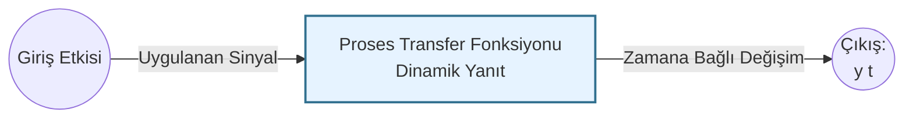
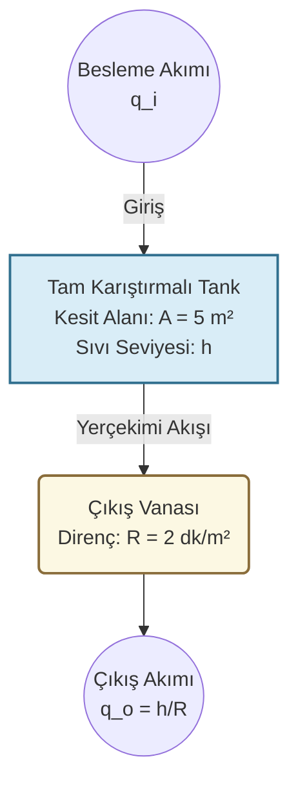

## KMB401 Proses Kontrol - Detaylı Çalışma ve Analiz Senaryoları

Bu bölüm, proses kontrol dinamiklerinin matematiksel temellerini ve fiziksel karşılıklarını birleştiren, sınav formatına uygun lisans seviyesi çalışma sorularını içermektedir. Çözümler, ezberden ziyade mühendislik yaklaşımını (modelleme, s-domenine geçiş, analiz) kavramaya yönelik olarak yapılandırılmıştır.

### Soru 1: Birinci Mertebeden Sistemlerin Dinamik Analizi ve Son Değer Teoremi
**Soru:** Kimyasal bir prosesin dinamik davranışı, aşağıdaki birinci mertebeden lineer diferansiyel denklem ile tanımlanmaktadır[cite: 21]:

$$2\frac{dy}{dt}+8y=4$$

Sistemin başlangıç koşulu $y(0)=2$ olarak verilmiştir[cite: 21].
a) Bu sistemi Laplace dönüşümü kullanarak zaman domeninde ($y(t)$) çözünüz[cite: 21].
b) Sistemin ulaşacağı yeni kararlı hal (son) değerini fiziksel anlamıyla açıklayarak bulunuz[cite: 21].

**Sistem Blok Diyagramı (Simulink/Matlab Gösterimi):**

**Eğitici Mühendislik Çözümü:**

1.  **Diferansiyel Denklemin s-Domenine Aktarılması (Laplace Dönüşümü):**
    Zaman ($t$) domenindeki türevsel değişimleri cebirsel olarak çözebilmek için denklemin her iki tarafının Laplace dönüşümü alınır. Başlangıç koşulunu ($y(0)=2$) doğrudan işleme dahil etmeliyiz.
    $2[sY(s)-y(0)]+8Y(s)=\frac{4}{s}$
    $2[sY(s)-2]+8Y(s)=\frac{4}{s}$

2.  **Cebirsel Düzenleme ve Y(s)'in Yalnız Bırakılması:**
    Sistemin çıkış fonksiyonu $Y(s)$'i bir tarafa toplayarak denklemi çözülebilir kesir formuna getiriyoruz.
    $2sY(s)-4+8Y(s)=\frac{4}{s}$
    $Y(s)(2s+8)=\frac{4}{s}+4=\frac{4s+4}{s}$
    $Y(s)=\frac{4s+4}{s(2s+8)}=\frac{2s+2}{s(s+4)}$

3.  **Kısmi Kesirlere Ayırma (Partial Fractions):**
    Ters Laplace tablosundaki standart formlara ulaşmak için karmaşık kesri basit bileşenlere ayırıyoruz.
    $\frac{2s+2}{s(s+4)}=\frac{A}{s}+\frac{B}{s+4}$
    Payları eşitleyerek: $A(s+4)+Bs=2s+2$
    *   $s=0$ için: $4A=2 \implies A=0.5$
    *   $s=-4$ için: $-4B=-8+2 \implies B=1.5$
    
    Kısmi kesir formu: $Y(s)=\frac{0.5}{s}+\frac{1.5}{s+4}$

4.  **Zaman Domenine Geri Dönüş (Ters Laplace):**
    Bulduğumuz $s$-domeni fonksiyonunu, fiziksel dünyada karşılığı olan zamana bağlı bir fonksiyona ($y(t)$) dönüştürüyoruz.
    $y(t)=0.5+1.5e^{-4t}$
    *(Öğretici Not: Buradaki $e^{-4t}$ terimi, sistemin başlangıçtaki "geçici (transient)" tepkisini gösterir ve zamanla sönümlenir.)*

5.  **Son Değer (Final Value) Analizi:**
    Sistem yeterince uzun süre çalıştırıldığında ($t \to \infty$), geçici rejim biter ve yeni bir kararlı hale (steady-state) ulaşılır[cite: 21].
    $y(\infty)=0.5+1.5e^{-\infty}=0.5+0=0.5$
    *(Sistem 2 birimlik başlangıç durumundan harekete geçmiş, dinamik tepkisini vermiş ve $t=\infty$ anında $0.5$ birimlik yeni dengesine oturmuştur.)*

---

### Soru 2: Sıvı Seviye Kontrol Sistemi ve Basamak (Step) Etki Analizi
**Soru:** Kesit alanı $A=5\text{ m}^2$ olan bir prosese $q_i$ hacimsel debisi ile sıvı beslenmektedir[cite: 21]. Çıkış debisi sıvı seviyesi ($h$) ile vananın direncine ($R$) bağlı olarak $q_o=\frac{h}{R}$ kuralına göre değişmektedir[cite: 21]. Vana direnci $R=2\text{ dk/m}^2$'dir[cite: 21]. Proses başlangıçta $q_{is}=2\text{ m}^3/\text{dk}$ giriş debisi ile kararlı (steady-state) haldedir.
a) Sıvı seviyesinin giriş debisine oranını veren transfer fonksiyonunu ($\frac{H'(s)}{Q_i'(s)}$) çıkarınız[cite: 20, 21].
b) Giriş debisinde aniden meydana gelen $0.5\text{ m}^3/\text{dk}$'lık bir basamak artışı (step change) sonrasında sistemin göstereceği seviye değişim profilini ($h(t)$) bulunuz[cite: 20, 21].

**Proses Akım Şeması (Aspen / ChemCAD PFD Gösterimi):**

**Eğitici Mühendislik Çözümü:**

1.  **Başlangıç Kararlı Hal (Steady-State) Koşullarının Belirlenmesi:**
    Herhangi bir bozucu etki gelmeden önce, tanka giren sıvı miktarı çıkan sıvı miktarına tam eşittir ve seviye sabittir.
    $q_{is}=q_{os}=\frac{h_s}{R} \implies 2=\frac{h_s}{2} \implies h_s=4\text{ m}$
    *(Tank başlangıçta 4 metre sıvı seviyesinde dengededir.)*

2.  **Fiziksel Kütle Denkliği ve Sapma Değişkenleri (Deviation Variables):**
    Genel korunum yasasına göre: $Giren - \text{\c{C}}\imath kan = Birikim$[cite: 20]
    $A\frac{dh}{dt}=q_i-\frac{h}{R}$
    Kontrol mühendisliğinde analizleri kolaylaştırmak için mutlak değerler yerine "kararlı halden sapma miktarları" kullanılır. Sapma değişkeni: $h'=h-h_s$ ve $q_i'=q_i-q_{is}$.
    Dinamik denklemden kararlı hal denklemi çıkarıldığında sapma modeli elde edilir:
    $A\frac{dh'}{dt}=q_i'-\frac{h'}{R}$

3.  **Transfer Fonksiyonunun Türetilmesi:**
    Sapma modelinin (başlangıç şartı $h'(0)=0$ kabulüyle) Laplace dönüşümü alınır[cite: 20]. Bu kabul, sistemin tam $t=0$ anında dengede olduğunu belirtir.
    $AsH'(s)=Q_i'(s)-\frac{H'(s)}{R}$
    $H'(s)(As+\frac{1}{R})=Q_i'(s) \implies \frac{H'(s)}{Q_i'(s)}=\frac{R}{ARs+1}$
    Sistem parametreleri ($A=5$, $R=2$) yerine konulduğunda transfer fonksiyonu:
    $G_p(s)=\frac{H'(s)}{Q_i'(s)}=\frac{2}{10s+1}$
    *(Öğretici Not: Bu format $\frac{K_p}{\tau s+1}$ şeklindeki standart 1. mertebe transfer fonksiyonudur. Sistemin kazancı $K_p=2$, zaman sabiti $\tau=10$ dakikadır.)*

4.  **Basamak (Step) Etki Sistem Yanıtının Çözümlenmesi:**
    Giriş debisi $2\text{ m}^3/\text{dk}$'dan $2.5\text{ m}^3/\text{dk}$'ya çıktığı için oluşan sapma (hata):
    $\Delta q_i=2.5-2=0.5\text{ m}^3/\text{dk}$[cite: 20, 21]
    Anlık kalıcı bir değişim olduğu için Laplace karşılığı bir basamak fonksiyonudur[cite: 20, 21]: $Q_i'(s)=\frac{0.5}{s}$
    Bunu transfer fonksiyonunda yerine koyduğumuzda:
    $H'(s)=(\frac{2}{10s+1})(\frac{0.5}{s})=\frac{1}{s(10s+1)}=\frac{0.1}{s(s+0.1)}$

5.  **Kısmi Kesirler ve Ters Laplace:**
    $\frac{0.1}{s(s+0.1)}=\frac{C_1}{s}+\frac{C_2}{s+0.1}$
    *   $s=0$ için $C_1=1$
    *   $s=-0.1$ için $C_2=-1$
    
    $H'(s)=\frac{1}{s}-\frac{1}{s+0.1}$
    Ters Laplace ile sapma fonksiyonu bulunur: $h'(t)=1-e^{-0.1t}$

6.  **Mutlak (Gerçek) Seviye Profili:**
    Gerçek tank seviyesi, başlangıçtaki kararlı hal seviyesi ile sapma miktarının toplamıdır.
    $h(t)=h_s+h'(t)=4+(1-e^{-0.1t})=5-e^{-0.1t}$
    *(Fiziksel Yorum: Vana açılıp tanka daha fazla sıvı girmeye başladığında seviye logaritmik olarak artacak ve $t \to \infty$ anında tank taşmadan tam $5\text{ m}$ seviyesinde yeni bir hidrodinamik dengeye oturacaktır.)*
