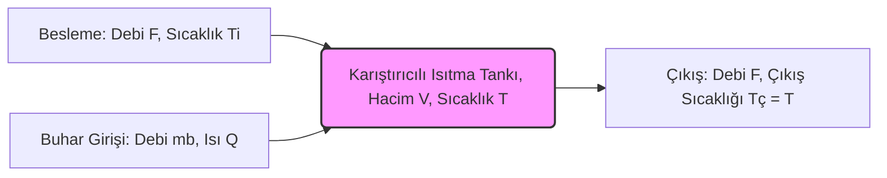

# KMB401 Proses Kontrol - Sınav Hazırlık ve Çalışma Portfolyosu[cite: 1]
> **Yazar / Mühendis:** [tugba-kir](https://github.com/tugba-kir)
> **Ders:** KMB401 Proses Kontrol (Ondokuz Mayıs Üniversitesi Kimya Mühendisliği Bölümü)[cite: 1, 3]

---

## ADIM 1: KAPSAMLI HAFTALIK DERS NOTU (Hafta 01-03)

### Hafta 1: Proses Dinamiği için Modelleme Araçları ve Temel Kavramlar[cite: 2]
Proses kontrol, endüstriyel sistemlerde belirlenen değişkenlerin (sıcaklık, basınç, debi vb.) istenen referans değerlerde (Set Point) tutulmasını sağlayan mühendislik disiplinidir[cite: 1, 5]. 

**Kritik Değişken Tanımları:**
*   **Ölçülen Değişken (PV - Process Variable):** Sistemden anlık olarak okunan değer[cite: 5, 6].
*   **Referans Değer (SP - Set Point):** Sistemin ulaşması istenen hedef değer[cite: 5, 6].
*   **Kontrol Edilen Değişken:** Üzerinde doğrudan denetim kurulan parametre (Örn: Çıkış sıcaklığı $T$)[cite: 5, 6].
*   **Ayar Değişkeni (Manipulated Variable):** Kontrolü sağlamak için müdahale edilen parametre (Örn: Su buharı debisi)[cite: 5, 6].
*   **Bozucu Etken (Load/Yük Değişkeni):** Kontrol dışı değişerek sistemi saptıran etken (Örn: Besleme debisi $F$)[cite: 6].
*   **Hata Fonksiyonu ($\epsilon$):** $\epsilon(t) = SP - PV$ formülü ile hesaplanan, sistemin hedefinden sapma miktarıdır[cite: 6].

**Proses Türleri ve Kararlılık Analizi (Tahta Notları):**[cite: 15]
*   **Kesikli (Batch) Prosesler:** Sisteme başlangıçta reaktantların yüklendiği ve işlemin sonunda ürünlerin alındığı sistemler[cite: 15].
*   **Sürekli (Continuous) Prosesler:** Sisteme kütle ve enerji giriş-çıkışının aralıksız devam ettiği sistemler[cite: 15].
*   **Karma (Semi-batch) Prosesler:** Sürekli ve kesikli operasyonların bir arada kullanıldığı sistemler[cite: 15].
*   **Kararlı Hal (Steady-State):** Değişkenlerin zamana bağlı değişiminin olmadığı, giren ve çıkan miktarların eşit olduğu durumdur[cite: 15].
*   **Kararlı Olmayan Hal (Unsteady-State / Dinamik):** Değişkenlerin zamanla değiştiği durumdur[cite: 15].
*   **Sapma Değişkeni (Deviation Variable):** "Kararlı Olmayan Hal - Kararlı Hal" farkı alınarak bulunur. Modeller bu hata/sapma payı üzerinden hesaplanır[cite: 15].

**Endüstriyel Ölçüm Enstrümantasyonu:**
*   **Sıcaklık:** Termometre, direnç termometresi, termokupl, bimetal termometre, radyasyon pirometreleri[cite: 5].
*   **Basınç:** Manometre, diyaframlı elemanlar, piezoelektrik sensörler[cite: 5].
*   **Debi:** Orifismetre, venturimetre, sıcak tel anemometresi, ultrases[cite: 6].
*   **Sıvı Seviyesi:** Şamandıralı aletler, sıvı basıncı ölçen aletler, iletkenlik ölçümü, ses rezonansı[cite: 6].
*   **Konsantrasyon:** Kromatografik analizörler, potansiyometrik analizörler, spektrofotometre, TGA[cite: 6].

---

### Hafta 2: Proses Dinamiği ve Matematiksel Modelleme Araçları (Laplace Dönüşümleri)[cite: 2]
Laplace dönüşümü, zaman domeni ($t$) diferansiyel denklemlerini, karmaşık $s$ domeninde cebirsel denklemlere indirgeyerek analitik çözümü kolaylaştırır[cite: 8].

**Tanım Bağıntısı:**

$$F(s)=\mathcal{L}(f(t))=\int_{0}^{\infty} e^{-st} f(t) dt$$

**Temel Giriş Fonksiyonları ve Laplace Dönüşümleri:**
*   **Basamak (Step) Fonksiyonu:** Sisteme anlık ve sabit bir sinyal uygulamasını ifade eder[cite: 9, 10]. 
    *   $f(t)=h \cdot u(t) \implies \mathcal{L}(h \cdot u(t))=\frac{h}{s}$[cite: 10]
*   **Darbe (Pulse) Fonksiyonu:** Belirli bir $t_0$ anına kadar sabit uygulanıp sonra sıfırlanan sinyaldir[cite: 9, 10].
    *   $f(t)=h \cdot u(t)-h \cdot u(t-t_0) \implies \mathcal{L}(f(t))=\frac{h}{s}(1-e^{-t_0 s})$[cite: 10]
*   **Rampa (Ramp) Fonksiyonu:** Sisteme zamanla lineer artan bir etki geldiğinde kullanılır[cite: 9, 11].
    *   $f(t)=A \cdot t \implies \mathcal{L}(A \cdot t)=\frac{A}{s^2}$[cite: 11]

**Türev Dönüşümleri:**
*   $\mathcal{L}(f'(t))=sF(s)-f(0)$[cite: 12]
*   $\mathcal{L}(f''(t))=s^2F(s)-sf(0)-f'(0)$[cite: 12]
---

### Hafta 3: Doğrusal Açık Döngü Sistemler ve Karıştırıcılı Tank Modeli[cite: 2]
Proses kontrol senaryolarında, kontrol edicinin etkisinin (geri besleme) olmadığı durumlara *Açık Çevrim (Open Loop)* denir[cite: 5]. Endüstride en sık karşılaşılan açık çevrim modellerinden biri **Isıtmalı Karıştırıcılı Tank** sistemidir[cite: 6, 7].

*Tankın tam karıştırmalı (CSTR) olduğu varsayılırsa, reaktör içindeki sıcaklık, çıkış sıcaklığına eşittir.*[cite: 7]

---

## ADIM 2: KRİTİK HESAPLAMA VE SINAV SENARYOLARI

### Senaryo 1: Diferansiyel Denklem Çözümü ve Kısmi Kesirlere Ayırma Yöntemi
**Soru:** Başlangıç koşulları $x(0) = 0$ ve $x'(0) = 0$ olan aşağıdaki 2. mertebeden diferansiyel denklemi Laplace dönüşümü ile çözünüz:

$$ \frac{d^2x}{dt^2} + 6\frac{dx}{dt} + 8x = 2 $$

**Mühendislik Çözüm Şablonu:**
1.  **Her iki tarafın Laplace Dönüşümünü al:**
    $[s^2X(s) - sx(0) - x'(0)] + 6[sX(s) - x(0)] + 8X(s) = \frac{2}{s}$
2.  **Başlangıç koşullarını uygula ve düzenle:**
    $X(s)(s^2 + 6s + 8) = \frac{2}{s} \implies X(s) = \frac{2}{s(s+4)(s+2)}$
3.  **Kısmi Kesirlere Ayırma:**
    $\frac{2}{s(s+4)(s+2)} = \frac{A}{s} + \frac{B}{s+4} + \frac{C}{s+2}$
    Payları eşitleyerek: $A = 1/4$, $B = 1/4$, $C = -1/2$ bulunur.
    $X(s) = \frac{1/4}{s} + \frac{1/4}{s+4} - \frac{1/2}{s+2}$
4.  **Ters Laplace Dönüşümü:**
    Standart tablo kuralı: $\mathcal{L}^{-1}\{\frac{1}{s+a}\} = e^{-at}$
    $x(t) = \frac{1}{4} + \frac{1}{4}e^{-4t} - \frac{1}{2}e^{-2t}$

### Senaryo 2: Termodinamik Enerji Denkliği Kurulumu
**Soru:** Isıtmalı CSTR için genel dinamik (unsteady-state) enerji denklemini kurunuz.

**Mühendislik Çözüm Şablonu:**
1.  **Korunum Prensibi:** $Giren - Çıkan + \ddot{U}retim = Birikim$
2.  **Giren Enerji Hızı:** $\rho F C_p (T_i - T_{ref}) + Q$
3.  **Çıkan Enerji Hızı:** $\rho F C_p (T - T_{ref})$
4.  **Birikim Hızı:** $\frac{d(\rho V C_p T)}{dt}$
5.  **Dinamik Matematiksel Model:**
    $\rho V C_p \frac{dT}{dt} = \rho F C_p (T_i - T) + Q$
---

## ADIM 3: İNTERAKTİF HIZLI TEKRAR KARTLARI (Flashcards)

<b>Soru 1:</b> Hata (Error) fonksiyonu nasıl tanımlanır?

<b>Cevap:</b> Hata ($\epsilon$) = Ölçülen Değişken (PV) - İstenilen Referans Değer (SP)[cite: 5, 6]. Hedef değerden sapma miktarını ifade eder.

<b>Soru 2:</b> Sapma Değişkeni (Deviation Variable) kontrol hesaplarında ne işe yarar?

<b>Cevap:</b> Dinamik hal ile kararlı hal arasındaki farkı gösterir[cite: 15]. Diferansiyel denklemler bu sapmalar üzerinden kurularak Laplace dönüşümü işlemleri uygulanabilir hale getirilir[cite: 15].

<b>Soru 3:</b> Laplace dönüşümünün proses kontrolündeki temel amacı nedir?

<b>Cevap:</b> Zamana bağlı karmaşık diferansiyel denklemleri[cite: 5], s-domeninde cebirsel denklemlere dönüştürerek transfer fonksiyonu hesaplamalarını ve analitik çözümü kolaylaştırmaktır[cite: 8].

<b>Soru 4:</b> Prosese uygulanan anlık/sabit şok yüklemeleri hangi fonksiyonla modellenir?

<b>Cevap:</b> Basamak (Step) Fonksiyonu ile modellenir[cite: 10]. Zaman domeninde $h \cdot u(t)$, Laplace domeninde ise $h/s$ olarak gösterilir[cite: 10].

