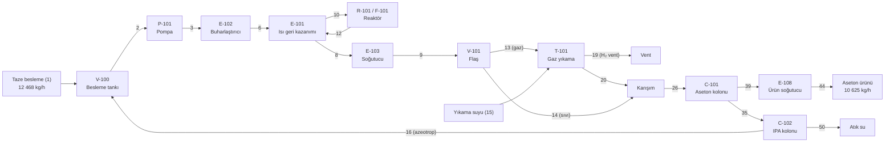
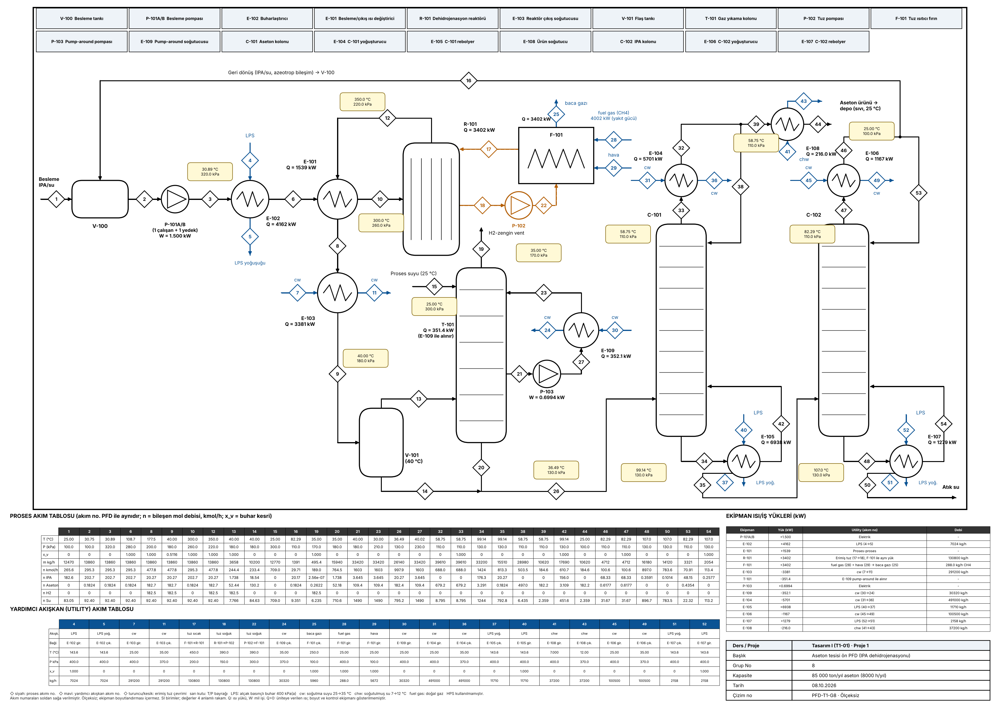
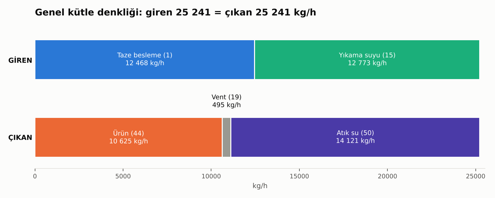
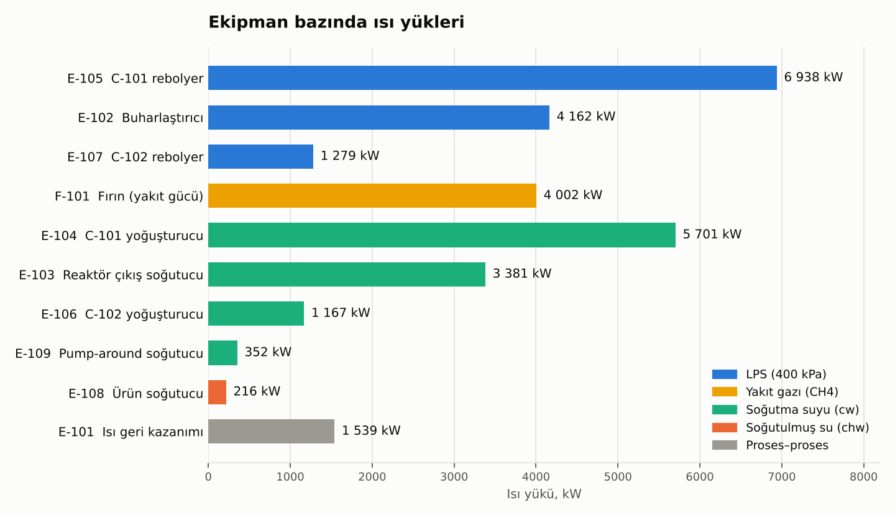

# Aseton Üretim Tesisi Ön Tasarımı: İzopropanolün Katalitik Dehidrojenasyonu

| Öğe | Bilgi |
|---|---|
| Ders / Grup | Tasarım I (T1-01) · Grup 8 |
| Kapsam | Ön tasarım: kütle ve enerji denklikleri, proses akış şeması (PFD), tasarım raporu |
| Yöntem | Kısa yol (shortcut) hesabı, Python |
| Durum | Tamamlandı; ticari proses simülatörü ile karşılaştırma yapılmadı |

**Özet.** Bu çalışmada, izopropanolün (IPA) gaz fazında katalitik dehidrojenasyonuyla yılda 85 000 ton aseton üreten bir tesisin ön tasarımı yapılmıştır. Tasarım esası, proses akışı, kütle ve enerji denklikleri ile yardımcı akışkan gereksinimleri Python ile hesaplanmış; sonuçlar bir A3 proses akış şemasında ve beş sayfalık bir raporda sunulmuştur. Ürün, ağırlıkça en az %99.5 saflıkta, 25 °C'de sıvı asetondur. Genel kütle, element ve enerji denklikleri sayısal kesinlikle kapanmaktadır. Dönüşüm ve seçicilik tasarım kabulüdür ve sonuçlar bir simülatörle doğrulanmamıştır (Bölüm 6).

**İçindekiler:** [1 Tasarım esası](#1-tasarım-esası) · [2 Proses tanımı](#2-proses-tanımı) · [3 Sonuçlar](#3-sonuçlar) · [4 Yöntem ve varsayımlar](#4-yöntem-ve-varsayımlar) · [5 Doğrulama](#5-doğrulama) · [6 Sınırlamalar](#6-sınırlamalar) · [7 Tekrarlanabilirlik](#7-tekrarlanabilirlik) · [Kaynaklar](#kaynaklar)

---

## 1. Tasarım Esası

Reaksiyon endotermik ve katalizörlüdür:

(CH₃)₂CHOH(g) → (CH₃)₂CO(g) + H₂(g)

*Tablo 1. Tasarım esası.*

| Parametre | Değer | Not |
|---|---|---|
| Kapasite | 85 000 t/yıl | 8000 h/yıl çalışma |
| Ürün debisi | 10 625 kg/h | |
| Ürün spesifikasyonu | ≥ %99.5 aseton (ağırlıkça %0.40 su) | 25 °C, 100 kPa, sıvı |
| Taze besleme | 12 468 kg/h IPA–su | Ağırlıkça %88 IPA (azeotropa yakın) [2, 3] |
| Reaktör sıcaklığı / basıncı | 350 °C / 220 kPa (çıkış) | Buhar fazı, Cu/Zn tipi katalizör [3, 5, 6] |
| Tek geçiş dönüşümü | %90 | Tasarım kabulü; denge dönüşümü %97.6 |
| Reaksiyon entalpisi | +55.50 kJ/mol (298 K); +57.98 kJ/mol (350 °C) | Oluşum entalpilerinden [8, 9] |
| Yardımcı akışkanlar | LPS 400 kPa(a); soğutma suyu 25 → 35 °C; soğutulmuş su 7 → 12 °C; yakıt gazı (CH₄); erimiş tuz 450 → 390 °C | |

Ekipman boyutlandırması, kontrol ve ölçüm donanımı ile P&ID çalışma kapsamı dışındadır.

---

## 2. Proses Tanımı

Proses; besleme hazırlama ve buharlaştırma, katalitik reaksiyon, reaktör çıkışının soğutulması ve faz ayrımı, gaz yıkama ve iki kademeli damıtmadan oluşur. Ayrılan IPA–su azeotropu besleme tankına geri döndürülür.



*Şekil 1. Blok akış şeması (akım numaraları PFD ile aynıdır).*

Birim işlemlerin görevleri Tablo 2'de, ayrıntılı çizim Şekil 2'de verilmiştir.

*Tablo 2. Ekipman listesi ve görevleri.*

| Kod | Ekipman | Görev | Isı yükü / güç |
|---|---|---|---|
| V-100 | Besleme tankı | Taze besleme ile geri dönüş akımını karıştırır | — |
| P-101 | Besleme pompası | 100 → 320 kPa | 1.5 kW |
| E-102 | Buharlaştırıcı | LPS ile doymuş buhar üretir | 4 162 kW |
| E-101 | Besleme/çıkış ısı değiştiricisi | Reaktör çıkışı ile beslemeyi ısıtır | 1 539 kW |
| R-101 | Reaktör | Katalizör yatağı, erimiş tuzla ısıtılır | 3 402 kW |
| F-101 | Tuz ısıtıcı fırın | CH₄ ile yanma, tuz 390 → 450 °C | 4 002 kW (yakıt) |
| P-102 | Tuz pompası | Erimiş tuz döngüsü | — |
| E-103 | Reaktör çıkış soğutucusu | 177.5 → 40 °C (soğutma suyu) | 3 381 kW |
| V-101 | Flaş tankı | 40 °C'de gaz/sıvı ayrımı | — |
| T-101 | Gaz yıkama kolonu | Gazdaki asetonu suya alır, H₂ vent edilir | 351 kW |
| P-103 | Pump-around pompası | Absorpsiyon ısısının çekilmesi | 0.70 kW |
| E-109 | Pump-around soğutucusu | 40 → 30 °C (soğutma suyu) | 352 kW |
| C-101 | Aseton kolonu | Üst: aseton; dip: su + IPA (R = 2.728) | — |
| E-104 | C-101 yoğuşturucusu | Tam yoğuşturucu (soğutma suyu) | 5 701 kW |
| E-105 | C-101 rebolyeri | Kettle tipi (LPS) | 6 938 kW |
| E-108 | Ürün soğutucusu | 58.75 → 25 °C (soğutulmuş su) | 216 kW |
| C-102 | IPA kolonu | Üst: IPA–su azeotropu; dip: su (R = 2.387) | — |
| E-106 | C-102 yoğuşturucusu | Tam yoğuşturucu (soğutma suyu) | 1 167 kW |
| E-107 | C-102 rebolyeri | Kettle tipi (LPS) | 1 279 kW |

<a href="docs/PFD_A3.pdf"></a>

*Şekil 2. Proses akış şeması (A3). Vektör çizim: [docs/PFD_A3.pdf](docs/PFD_A3.pdf).*

---

## 3. Sonuçlar

**Kütle denkliği.** Giren akımlar (taze besleme ve yıkama suyu) toplamı, çıkan akımlar (ürün, vent, atık su) toplamına eşittir (Şekil 3). Bileşen, element (C, H, O) ve kütle denklikleri her ekipman için ayrı ayrı kurulmuştur; en büyük bağıl hata 10⁻¹⁰ %'un altındadır (şartname sınırı %1).



*Şekil 3. Genel kütle denkliği (kg/h).*

*Tablo 3. Seçili proses akımları.*

| Akım | Tanım | T (°C) | P (kPa) | ṁ (kg/h) |
|---|---|---|---|---|
| 1 | Taze besleme | 25.0 | 100 | 12 468 |
| 10 | Reaktör girişi | 300.0 | 260 | 13 859 |
| 12 | Reaktör çıkışı | 350.0 | 220 | 13 859 |
| 13 | Flaş gazı | 40.0 | 180 | 3 658 |
| 14 | Flaş sıvısı | 40.0 | 180 | 10 201 |
| 15 | Yıkama suyu | 25.0 | 300 | 12 773 |
| 19 | H₂ vent | 35.0 | 170 | 495 |
| 26 | C-101 beslemesi | 36.5 | 130 | 26 137 |
| 44 | Aseton ürünü | 25.0 | 100 | 10 625 |
| 16 | IPA–su geri dönüşü | 82.3 | 110 | 1 391 |
| 50 | Atık su | 107.0 | 130 | 14 121 |

Tüm akımlar: [outputs/akim_tablosu.csv](outputs/akim_tablosu.csv).

**Enerji denkliği.** Ekipman bazında ısı yükleri Şekil 4'te, yardımcı akışkan toplamları Tablo 4'te verilmiştir.



*Şekil 4. Ekipman bazında ısı yükleri (kW).*

*Tablo 4. Yardımcı akışkan gereksinimleri.*

| Yardımcı akışkan | Koşul | Toplam yük |
|---|---|---|
| LPS | 400 kPa(a), 143.6 °C [15] | 12 380 kW |
| Soğutma suyu | 25 → 35 °C | ≈ 10 600 kW |
| Soğutulmuş su | 7 → 12 °C | 216 kW |
| Yakıt gazı (CH₄) | Fırın verimi %85 | 4 002 kW (288 kg/h) |
| Isı geri kazanımı (E-101) | Proses–proses | 1 539 kW |

---

## 4. Yöntem ve Varsayımlar

*Tablo 5. Hesap yöntemi.*

| No | Konu | Yaklaşım |
|---|---|---|
| 1 | Buhar–sıvı dengesi | IPA–su ve aseton–su: Wilson modeli (ChemSep parametreleri) [11]; aseton–IPA: ideal |
| 2 | Gaz yıkama | Aseton için Henry sabiti [14]: γ∞ = 8.07, K = 2.072 |
| 3 | Reaksiyon | ΔH oluşum entalpilerinden [8, 9]; K_eq Gibbs enerjisinden (K_eq(350 °C) = 36.49, X_eq = 0.9764) |
| 4 | Absorber | Absorpsiyon faktörü A = 1.4 [12, 13]; Kremser yöntemi: N ≈ 12 teorik kademe, aseton geri kazanımı %99.5 |
| 5 | Damıtma kolonları | McCabe–Thiele, R = 1.3 R_min, tam yoğuşturucu, kettle rebolyer |
| 6 | Entalpi | Referans: 25 °C'de elementler; ideal karışım; sabit sıvı C_p |
| 7 | Dönüşüm ve seçicilik | X = %90 ve seçicilik %100 tasarım kabulüdür |

Benzer bir sistem için bildirilen %99.4 seçicilik değeri [6] kullanılsaydı, yaklaşık 1.1 kmol/h IPA (65.8 kg/h) yan ürünlere gider ve ürün debisi yaklaşık %0.6 azalırdı.

---

## 5. Doğrulama

*Tablo 6. Tutarlılık kontrolleri.*

| Kontrol | Sonuç |
|---|---|
| Kütle denkliği (genel ve her ekipman) | Bağıl hata ≈ 10⁻¹² % |
| Element denkliği (C, H, O) | Hata ≈ 0 |
| Enerji denkliği | Hata ≈ 10⁻¹¹ kW |
| Tasarım kontrolleri | 15/15 geçti |
| Veri/model testleri (buhar basıncı, C_p, ΔH, buharlaşma entalpisi vb.) | 15/15 geçti |
| Vent akımındaki su: model %3.30 (mol); 35 °C'de suyun buhar basıncı ≈ 5.63 kPa, toplam basınç 170 kPa → ≈ %3.31 | Uyumlu |
| Kolon sıcaklıkları: C-101 üst 58.75 °C (110 kPa); C-102 üst 82.29 °C; C-102 dip 107 °C (130 kPa) | Fiziksel olarak tutarlı |
| E-102 yükü: elle yaklaşık hesap ≈ 4 136 kW; model 4 162 kW | Fark ≈ %0.6 |

Ayrıntılı sonuçlar: [outputs/dogrulama_testleri.csv](outputs/dogrulama_testleri.csv).

---

## 6. Sınırlamalar

1. Ticari proses simülatörü (HYSYS, ChemCAD) ile karşılaştırma yapılmamıştır; sonuçlar kısa yol hesabıdır.
2. Dönüşüm (%90) ve seçicilik (%100) tasarım kabulüdür; kinetik model kullanılmamıştır.
3. Reaksiyon entalpisi oluşum entalpilerinden hesaplanmıştır (+55.50 kJ/mol). Bir tasarım problemi tanımında [3] 62.9 kJ/mol verilmiş, referans durumu belirtilmemiştir. Aradaki fark reaktör ısı yükünde yaklaşık %7'dir (≈ 250 kW).
4. Erimiş tuzun ısıl kapasitesi (1.56 kJ/kg·K) kaynaktan doğrulanmamıştır; yalnızca tuz debisini etkiler.
5. Aseton–IPA karışımı ideal kabul edilmiştir.
6. Rebolyer ısı yükleri enerji denkliğinden türetilmiştir; bu nedenle bu ekipmanlar için denklik kapanması bağımsız bir doğrulama değildir.
7. Reflü kapları, vanalar ve pompaların çoğu hesaba ve çizime dahil edilmemiştir. Isı entegrasyonu yalnızca E-101 ile sınırlıdır.
8. Türkiye'deki yerli aseton üretim kapasitesi için güvenilir kaynak bulunamamıştır; yalnızca dış ticaret verisi (HS 291411) kullanılmıştır [7].

---

## 7. Yazılım, Test ve Tekrarlanabilirlik

Hesap çekirdeği, `aseton` adlı bir Python paketi olarak modüllere ayrılmıştır; her modülün tek bir görevi vardır.

| Modül | Görev |
|---|---|
| `data.py`, `params.py` | Bileşen verileri (kaynaklı) ve tasarım parametreleri |
| `thermo.py` | Buhar basıncı, kabarcık/çiğ noktası, entalpi, denge sabiti |
| `columns.py` | Kolon kısa yol hesabı (Fenske–Underwood–Gilliland), Kremser absorber |
| `flowsheet.py` | Akış şemasının çözümü (akımlar, yükler, ekipman denklikleri) |
| `balances.py`, `checks.py` | Kütle/element/enerji denklikleri, tasarım kontrolleri, veri testleri |
| `pfd.py` | A3 proses akış şeması ve akım numaralandırması |
| `worksheet.py`, `article.py`, `pdfutil.py` | Hesap föyü ve rapor üretimi |
| `cli.py` | Komut satırı: tüm çıktıları üretir |

```bash
git clone https://github.com/tugba-kir/OMU-donem-7.git
cd OMU-donem-7/TASARIM/IPA-Dehidrojenasyonu
pip install -e .
python -m aseton --out cikti        # PFD, rapor, föy ve CSV dosyaları
```

Google Colab'de: `!pip install -e .` ardından `!python -m aseton --out cikti`.
PDF'lerde Times benzeri yazı tipi (FreeSerif) bulunursa kullanılır; bulunmazsa DejaVu Serif'e geçilir ve rapor beş sayfaya sığacak şekilde yazı boyutu otomatik küçültülür.

### Testler

`tests/` klasöründe 34 otomatik test vardır; yalnızca standart `unittest` gerektirir.

```bash
PYTHONPATH=src python -m unittest discover -s tests -v
```

| Dosya | Neyi doğrular |
|---|---|
| `test_balances.py` | Her ekipmanda ve genelde kütle, element (C, H, O) ve enerji denkliği; negatif debi yok |
| `test_specs.py` | Kapasite (10 625 kg/h), ürün suyu ≤ %0.5, ürün sıvı 25 °C, dönüşüm < denge, stokiyometri, ΔH |
| `test_thermo.py` | Normal kaynama noktaları, 35 °C su buhar basıncı, IPA–su azeotropu, basınç–kaynama noktası ilişkisi |
| `test_phases.py` | Akım tablosundaki faz bilgisinin sıcaklık/basınçla tutarlılığı (bilinen tek sapma: akım 34, bkz. Bölüm 6) |
| `test_numbering.py` | Akım numaraları benzersiz, eksiksiz, soldan sağa |
| `test_energy.py` | Yardımcı akışkan toplamları, yakıt gazı, E-102 için bağımsız elle hesap, tasarım kontrolleri |
| `test_cli.py` | Uçtan uca çalışma, rapor ≤ 5 sayfa, PFD A3 boyutunda |

```
IPA-Dehidrojenasyonu/
├── README.md, LICENSE, pyproject.toml, requirements.txt
├── src/aseton/                     hesap paketi (yukarıdaki tablo)
├── tests/                          otomatik testler
├── docs/
│   ├── rapor.pdf                   tasarım raporu (5 sayfa)
│   ├── PFD_A3.pdf, PFD_A3.png      A3 proses akış şeması
│   ├── rapor_ve_pfd_tek_pdf.pdf    rapor ve PFD (6 sayfa)
│   ├── hesap_foyu.pdf              akım ve ekipman bazında hesaplar
│   └── img/                        bu dosyadaki şekiller
└── outputs/                        akım, yardımcı akışkan, ekipman denklikleri, doğrulama (CSV)
```

Kod MIT lisansı altındadır ([LICENSE](LICENSE)). Rapor ve çizimlerin kullanım koşulları çalışma grubunun kararına bağlıdır.

---

## 8. Katkı ve Araç Kullanımı

Bu çalışma Tasarım I dersi T1-01 Grup 8 kapsamında hazırlanmıştır. Grup lideri olarak hesapların ve akış şemasının tasarımını, verilen ödev isterlerine göre ben yaptım; kod ve belgelerin yazımında yapay zekâ asistanı (Claude, Anthropic) kullanıldı. Proses yapısı, kabuller, veri seçimi ve sonuçların denetimi bana aittir; asistan kod yazımı, hesap kontrolü ve belge üretiminde yardımcı olmuştur. Sonuçlar ticari bir simülatörle doğrulanmamıştır (Bölüm 6).

---

## Kaynaklar

1. Wikipedia. Acetone. https://en.wikipedia.org/wiki/Acetone
2. US Patent 4,666,560. Isopropanol–water binary azeotrope (80.4 °C, ağırlıkça %87.8 izopropanol). https://image-ppubs.uspto.gov/dirsearch-public/print/downloadPdf/4666560
3. West Virginia University. *Major No. 1 – Design Problems for the Acetone Production Facility* (18 Eylül 1998). https://richardturton.faculty.wvu.edu/files/d/843af43f-8ebf-46f9-b436-d875a616823c/acetone1.pdf
4. Wikipedia. Cumene process. https://en.wikipedia.org/wiki/Cumene_process
5. US Patent 4,380,673. Isopropanol, 2-butanol ve sikloheksanolün buhar fazında dehidrojenasyonu (300–550 °C). https://image-ppubs.uspto.gov/dirsearch-public/print/downloadPdf/4380673
6. US Patent 4,472,593. Izopropil alkolden aseton (brass spelter, 400 °C; %70 dönüşüm, %99.4 seçicilik). https://image-ppubs.uspto.gov/dirsearch-public/print/downloadPdf/4472593
7. World Bank. WITS / UN Comtrade: Türkiye, HS 291411 ithalat ve ihracat, 2019–2022. https://wits.worldbank.org/
8. EngineeringToolbox. Standard enthalpy of formation, Gibbs energy of formation, entropy and molar heat capacity of organic substances. https://www.engineeringtoolbox.com/standard-enthalpy-formation-value-Gibbs-free-energy-entropy-heat-capacity-organic-d_1979.html
9. Cheméo. 2-Propanol. https://www.chemeo.com/cid/24-809-7/2-Propanol
10. Rice University, CENG 403 (2011). *The Production of Acetone*. http://www.owlnet.rice.edu/~ceng403/gr11298/acetone.html
11. ChemSep Wilson etkileşim parametreleri (thermo deposu). https://github.com/CalebBell/thermo/blob/master/thermo/Interaction%20Parameters/ChemSep/wilson.json
12. NPTEL. Mass Transfer, Modül 7. https://archive.nptel.ac.in/content/storage2/courses/103103027/module7/lec6/3.html
13. EngineersUniverse. Absorption/Stripping Column Design Guide. https://engineersuniverse.com/studios/chemical-process/absorption-stripping-column-design-guide
14. Sander, R. (2023). Compilation of Henry's law constants (v5). *Atmos. Chem. Phys.*, 23, 10901. https://henrys-law.org/henry/casrn/67-64-1
15. NZIFST. Unit Operations, Appendix 8: Saturated steam tables. https://nzifst.org.nz/resources/unitoperations/appendix8.htm
