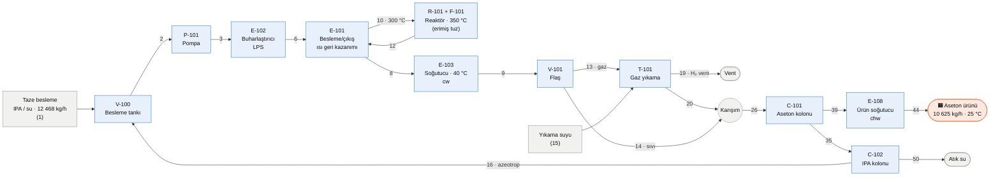

<div align="center">

# 🧪 Aseton Tesisi Ön Tasarımı

### İzopropanolün (IPA) katalitik dehidrojenasyonu ile **85 000 t/yıl** aseton

*Preliminary design of an acetone plant: catalytic dehydrogenation of isopropanol — shortcut mass & energy balances in Python, A3 PFD and a 5-page design report.*


**Tasarım I (T1-01) · Grup 8**

[📄 Rapor](docs/rapor.pdf) · [🗺️ A3 PFD](docs/PFD_A3.pdf) · [🧮 Hesap föyü](docs/hesap_foyu.pdf) · [🐍 Kod](src/aseton_plant_design.py)

</div>

---

## İçindekiler

1. [Tek bakışta](#-tek-bakışta)
2. [Proses akışı](#-proses-akışı)
3. [Akış şeması (PFD)](#-akış-şeması-pfd)
4. [Sonuçlar](#-sonuçlar)
5. [Ekipman listesi](#-ekipman-listesi)
6. [Yöntem ve varsayımlar](#-yöntem-ve-varsayımlar)
7. [Tutarlılık kontrolleri](#-tutarlılık-kontrolleri)
8. [Sınırlamalar](#-sınırlamalar-dürüst-not)
9. [Çalıştırma](#-çalıştırma)
10. [Depo yapısı](#-depo-yapısı)
11. [Kaynaklar](#-kaynaklar)

---

## 🔎 Tek bakışta

| | |
|---|---|
| **Reaksiyon** | (CH₃)₂CHOH → (CH₃)₂CO + H₂ &nbsp;(gaz fazı, endotermik, Cu/Zn tipi katalizör) |
| **Kapasite** | 85 000 t/yıl · 8000 h/yıl → **10 625 kg/h** aseton |
| **Ürün** | ≥ %99.5 aseton (ağırlıkça %0.40 su) · 25 °C · 100 kPa · sıvı |
| **Besleme** | IPA–su, ağırlıkça %88 IPA (azeotropa yakın) |
| **Reaktör** | 350 °C · girişte 220 kPa · tek geçiş dönüşümü %90 (denge: %97.6) |
| **Reaksiyon ısısı** | ΔH₂₉₈ = +55.50 kJ/mol · 350 °C'de +57.98 kJ/mol |
| **Ayırma** | Flaş → gaz yıkama (H₂ vent) → aseton kolonu → IPA kolonu (azeotrop geri dönüşü) |
| **Yardımcı akışkanlar** | LPS · soğutma suyu · soğutulmuş su · yakıt gazı (CH₄) · erimiş tuz |
| **Kapsam dışı** | Ekipman boyutlandırma · kontrol/sensör · P&ID |

---

## 🔄 Proses akışı



**Ne, neden?**

| Adım | Ekipman | Neden |
|---|---|---|
| 1 | V-100, P-101 | Taze besleme ile geri dönen IPA/su azeotropunu karıştırıp basınçlandırır |
| 2 | E-102, E-101 | Tepkime gaz fazında yapıldığı için sıvıyı buharlaştırır; reaktör çıkışının ısısıyla besleme 300 °C'ye ısıtılır |
| 3 | R-101 + F-101 | Katalizör yatağında IPA → aseton + H₂. Tepkime ısı çeker; ısı, yakıt gazı fırınında ısıtılan erimiş tuz döngüsünden gelir |
| 4 | E-103, V-101 | Reaktör çıkışı 40 °C'ye soğutulur: aseton, su ve IPA yoğuşur, H₂ gaz kalır; flaş fazları ayırır |
| 5 | T-101 | H₂ gazının taşıdığı asetonu (≈ 52 kmol/h) suyla geri alır, H₂ vent edilir |
| 6 | C-101, E-108 | Aseton–su azeotrop yapmadığı için tek kolon yeter; ürün 25 °C'ye soğutulup depoya gider |
| 7 | C-102 | IPA–su azeotropunu üstten V-100'e geri döndürür, dipten suyu atar |

---

## 🗺️ Akış şeması (PFD)

Tek sayfa A3: ekipman adları üst kenarda, akımlar soldan sağa numaralı, T/P bayrakları, yardımcı akışkanlar kW ile, akım tablosu altta.

<a href="docs/PFD_A3.pdf"></a>

<sub>Vektör çizim için [PDF sürümüne](docs/PFD_A3.pdf) bakın.</sub>

---

## 📊 Sonuçlar

### Genel kütle denkliği


Giren (taze besleme + yıkama suyu) ile çıkan (ürün + vent + atık su) toplamı aynıdır; hata ≈ 10⁻¹² %. Her ekipman için bileşen, element (C, H, O) ve kütle denkliği ayrı ayrı kapanır (şartname sınırı < %1).

### Isı yükleri


| Yardımcı akışkan | Toplam |
|---|---|
| LPS (400 kPa(a), 143.6 °C) | **12 380 kW** |
| Soğutma suyu (25 → 35 °C) | **≈ 10 600 kW** |
| Soğutulmuş su (7 → 12 °C) | **216 kW** |
| Yakıt gazı (CH₄), fırın verimi %85 | **4 002 kW** (288 kg/h) |
| Isı geri kazanımı (E-101) | 1 539 kW |

<details>
<summary><b>Ana akımlar (tıkla)</b></summary>

| Akım | Tanım | T (°C) | P (kPa) | kg/h |
|---|---|---|---|---|
| 1 | Taze besleme | 25.0 | 100 | 12 468 |
| 10 | Reaktör girişi | 300.0 | 260 | 13 859 |
| 12 | Reaktör çıkışı | 350.0 | 220 | 13 859 |
| 13 | Flaş gazı | 40.0 | 180 | 3 658 |
| 14 | Flaş sıvısı | 40.0 | 180 | 10 201 |
| 15 | Yıkama suyu | 25.0 | 300 | 12 773 |
| 19 | H₂ vent | 35.0 | 170 | 495 |
| 26 | C-101 beslemesi | 36.5 | 130 | 26 137 |
| 44 | **Aseton ürünü** | 25.0 | 100 | **10 625** |
| 16 | IPA/su geri dönüşü | 82.3 | 110 | 1 391 |
| 50 | Atık su | 107.0 | 130 | 14 121 |

Tüm akımlar: [`outputs/akim_tablosu.csv`](outputs/akim_tablosu.csv)

</details>

---

## 🧰 Ekipman listesi

<details>
<summary><b>Ekipman ve görevleri (tıkla)</b></summary>

| Kod | Ekipman | Görev | Isı yükü |
|---|---|---|---|
| V-100 | Besleme tankı | Taze besleme + geri dönüşü karıştırır | — |
| P-101 | Besleme pompası | 100 → 320 kPa | 1.5 kW |
| E-102 | Buharlaştırıcı | LPS ile doymuş buhar üretir | 4 162 kW |
| E-101 | Besleme/çıkış ısı değiştirici | Reaktör çıkışı ile beslemeyi ısıtır | 1 539 kW |
| R-101 | Dehidrojenasyon reaktörü | Katalizör yatağı, erimiş tuzla ısıtılır | 3 402 kW |
| F-101 | Tuz ısıtıcı fırın | CH₄ + hava, tuz 390 → 450 °C | 4 002 kW (yakıt) |
| P-102 | Tuz pompası | Erimiş tuz döngüsü | — |
| E-103 | Reaktör çıkış soğutucusu | 177.5 → 40 °C (cw) | 3 381 kW |
| V-101 | Flaş tankı | Gaz/sıvı ayrımı, 40 °C | — |
| T-101 | Gaz yıkama kolonu | Asetonu suya alır, H₂ vent | 351 kW (E-109 ile alınır) |
| P-103 | Pump-around pompası | Absorpsiyon ısısı çevrimi | 0.70 kW |
| E-109 | Pump-around soğutucusu | 40 → 30 °C (cw) | 352 kW |
| C-101 | Aseton kolonu | Üst: aseton, dip: su + IPA (R = 2.728) | — |
| E-104 | C-101 yoğuşturucu | Tam yoğuşturucu (cw) | 5 701 kW |
| E-105 | C-101 rebolyer | Kettle tipi (LPS) | 6 938 kW |
| E-108 | Ürün soğutucusu | 58.75 → 25 °C (chw) | 216 kW |
| C-102 | IPA kolonu | Üst: IPA–su azeotropu, dip: su (R = 2.387) | — |
| E-106 | C-102 yoğuşturucu | Tam yoğuşturucu (cw) | 1 167 kW |
| E-107 | C-102 rebolyer | Kettle tipi (LPS) | 1 279 kW |

</details>

---

## 🧠 Yöntem ve varsayımlar

| Konu | Yaklaşım |
|---|---|
| **Buhar–sıvı dengesi** | IPA–su ve aseton–su: Wilson (ChemSep parametreleri); aseton–IPA: ideal |
| **Gaz yıkama** | Aseton için Henry sabiti (Sander): γ∞ = 8.07, K = 2.072 |
| **Reaksiyon** | ΔH, oluşum entalpilerinden; Keq, Gibbs enerjisinden (Keq(350 °C) = 36.49, Xeq = 0.9764) |
| **Absorber** | Absorpsiyon faktörü A = 1.4, Kremser: N ≈ 12 teorik kademe, geri kazanım %99.5 |
| **Kolonlar** | McCabe–Thiele, R = 1.3 × Rmin, tam yoğuşturucu, kettle rebolyer |
| **Entalpi** | 25 °C elementlerden referans, ideal karışım, sabit sıvı Cp |
| **Yardımcı akışkanlar** | LPS 400 kPa(a); cw 25 → 35 °C; chw 7 → 12 °C; erimiş tuz 450 → 390 °C |
| **Dönüşüm / seçicilik** | X = %90 (tasarım kabulü), seçicilik %100 (kabul) |

**Seçicilik etkisi:** Kaynaklardaki benzer sistemde %99.4 seçicilik bildirilmiştir; bu değerle yaklaşık 1.1 kmol/h IPA (65.8 kg/h) yan ürüne gider, ürün ≈ %0.6 azalır.

---

## ✅ Tutarlılık kontrolleri

Kod çalışırken ve sonrasında şu kontroller yapılır; sonuçlar [`outputs/dogrulama_testleri.csv`](outputs/dogrulama_testleri.csv) içindedir.

| Kontrol | Sonuç |
|---|---|
| Kütle denkliği (genel ve her ekipman) | hata ≈ 10⁻¹² % |
| Element denkliği (C, H, O) | hata ≈ 0 |
| Enerji denkliği | hata ≈ 10⁻¹¹ kW |
| Tasarım kontrolleri | 15 / 15 geçti |
| Veri/model testleri (buhar basıncı, Cp, ΔH, buharlaşma entalpisi vb.) | 15 / 15 geçti |
| Vent'teki su: model %3.30 mol ↔ 35 °C'de suyun buhar basıncı (≈ 5.63 kPa) ÷ 170 kPa ≈ %3.31 | uyumlu |
| Kolon sıcaklıkları: C-101 üst 58.75 °C (110 kPa); C-102 üst 82.29 °C; dip 107 °C (130 kPa) | fiziksel olarak tutarlı |
| E-102 yükü: elle yaklaşık hesap ≈ 4 136 kW ↔ model 4 162 kW | fark ≈ %0.6 |

---

## ⚠️ Sınırlamalar (dürüst not)

- **Ticari simülatörle (HYSYS/ChemCAD) karşılaştırma yapılmadı.** Sonuçlar kısa yol hesabıdır.
- **Dönüşüm (%90) ve seçicilik (%100) tasarım kabulüdür;** kinetik model yoktur.
- **Reaksiyon ısısı:** Kaynaklı oluşum entalpilerinden hesaplandı (+55.50 kJ/mol). Bir tasarım problemi metninde 62.9 kJ/mol verilmiştir, referans durumu belirtilmemiştir; fark reaktör yükünde yaklaşık %7 (≈ 250 kW).
- **Erimiş tuz Cp** (1.56 kJ/kg·K) kaynaktan doğrulanmadı; yalnızca tuz debisini etkiler.
- **Aseton–IPA karışımı ideal** alındı.
- **Rebolyer yükleri** enerji denkliğinden türetildiği için "kapanması" bağımsız bir doğrulama değildir.
- **Reflü kapları, vanalar ve pompaların çoğu** çizimde ve hesapta yoktur; ısı entegrasyonu yalnızca E-101'dedir.
- **Türkiye yerli üretim kapasitesi** için güvenilir kaynak bulunamamıştır; yalnızca dış ticaret verisi (HS 291411) kullanılmıştır.

---

## ▶️ Çalıştırma

```bash
git clone https://github.com/tugba-kir/OMU-donem-7.git
cd OMU-donem-7/TASARIM/IPA-aseton
pip install -r requirements.txt
python src/aseton_plant_design.py
```

Çıktılar (rapor, PFD, hesap föyü, CSV'ler) çalışma klasörüne yazılır. **Google Colab'de** dosyanın içeriğini tek hücreye yapıştırmak yeterlidir; çıktılar otomatik indirilir.

> PDF'lerde Times benzeri yazı tipi (FreeSerif) bulunursa o kullanılır, yoksa DejaVu Serif'e geçilir ve rapor 5 sayfaya sığacak şekilde yazı boyutu otomatik küçültülür.

Gereksinimler: `numpy`, `scipy`, `pandas`, `matplotlib`, `reportlab`, `pypdf`, `pillow`.

---

## 📁 Depo yapısı

```
OMU-donem-7/TASARIM/IPA-aseton/
├── README.md
├── LICENSE
├── requirements.txt
├── src/
│   └── aseton_plant_design.py        # hesap çekirdeği + PFD + rapor + föy üretimi (tek dosya)
├── docs/
│   ├── rapor.pdf                     # 5 sayfalık tasarım raporu
│   ├── PFD_A3.pdf / PFD_A3.png       # A3 akış şeması
│   ├── rapor_ve_pfd_tek_pdf.pdf      # rapor + PFD (6 sayfa)
│   ├── hesap_foyu.pdf                # akım/ekipman bazında adım adım hesap
│   └── img/                          # README görselleri
└── outputs/
    ├── akim_tablosu.csv
    ├── yardimci_akimlar.csv
    ├── ekipman_denklikleri.csv
    └── dogrulama_testleri.csv
```

---

## 📚 Kaynaklar

1. Wikipedia, *Acetone* — kullanım alanları, üretim yolları.
2. ABD Patenti 4,666,560 — IPA–su azeotropu (80.4 °C, ağırlıkça %87.8 IPA).
3. *Major No. 1 – Design Problems for the Acetone Production Facility*, West Virginia University (18 Eylül 1998).
4. Wikipedia, *Cumene process*.
5. ABD Patenti 4,380,673 — IPA'nın buhar fazında 300–550 °C'de dehidrojenasyonu.
6. ABD Patenti 4,472,593 — IPA'dan aseton (brass spelter, 400 °C, %99.4 seçicilik).
7. World Bank WITS / UN Comtrade — Türkiye HS 291411 ithalat/ihracat, 2019–2022.
8. EngineeringToolbox — standart oluşum entalpisi, entropi tabloları.
9. Cheméo — 2-propanol termodinamik verileri.
10. Rice University CENG 403 (2011) — *The Production of Acetone*.
11. ChemSep Wilson etkileşim parametreleri (thermo deposu).
12. NPTEL, *Mass Transfer*, Modül 7 — absorpsiyon faktörü.
13. EngineersUniverse — *Absorption/Stripping Column Design Guide*.
14. Sander, R. (2023). *Compilation of Henry's law constants (v5)*. Atmos. Chem. Phys., 23, 10901.
15. NZIFST — doymuş buhar tabloları.

Bağlantılar ve ayrıntılar için [`docs/rapor.pdf`](docs/rapor.pdf) kaynakçasına bakınız.

---

## 📝 Lisans

Kod MIT lisansı altındadır ([`LICENSE`](LICENSE)). Rapor ve çizimler için kullanım/atıf kuralları grubun kararına bağlıdır.

<div align="center"><sub>Bu çalışma ön tasarım düzeyindedir; sonuçlar ticari simülatörle doğrulanmamıştır.</sub></div>
